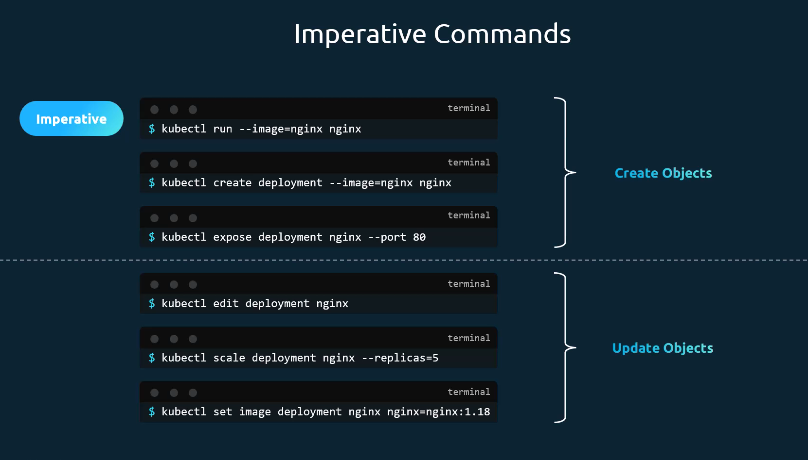
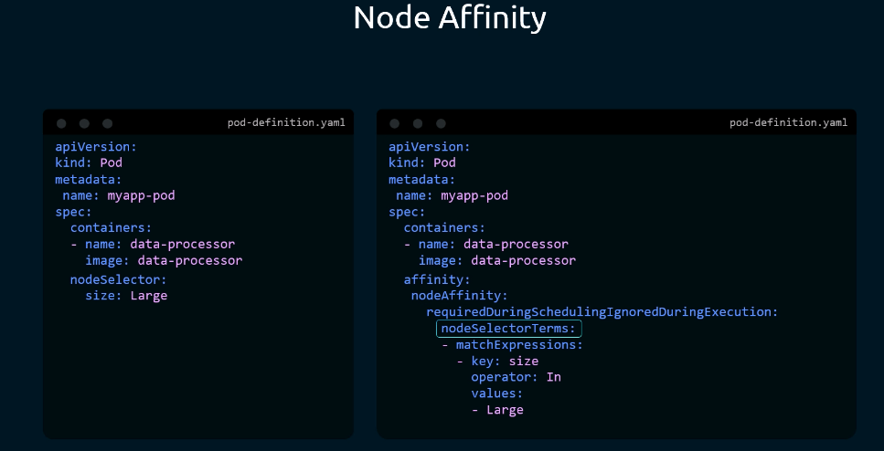
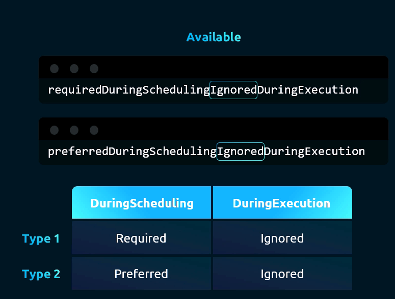
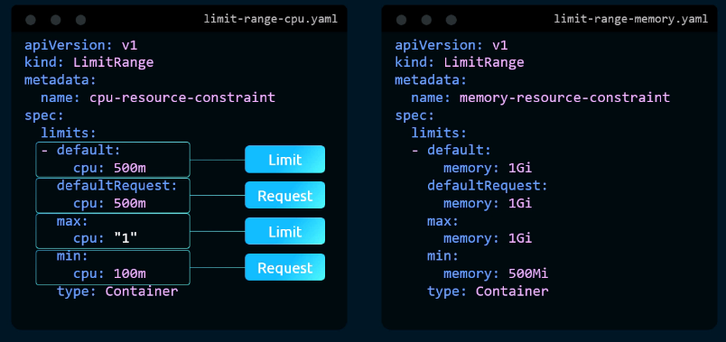
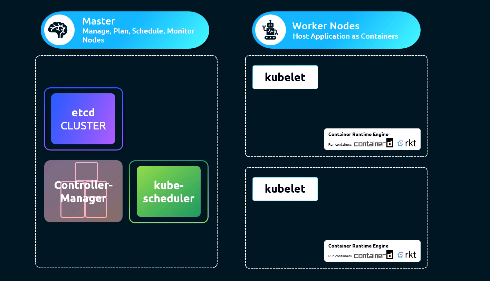
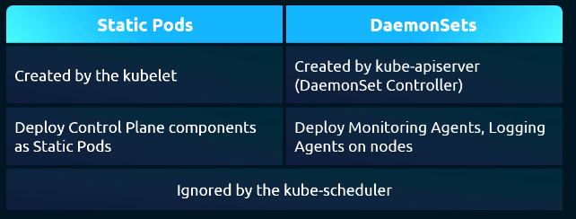

## Certified Kubernetes Administrator (CKA) 

**Docker Refresher** 

```bash
$ docker run ubuntu
$ docker ps 
$ docker ps -a
$ docker run kodekloud/simple-webapp
$ docker run -d kodekloud/simple-webapp 
$ docker attach name or id (a043d)

# run for 100 seconds 
$ docker run -d ubuntu sleep 100 

$ docker run -it centos bash 
# logs into the bash of container 

# remove docker containers 
$ docker rm container-name/id 

$ docker images 

# rmi for removing images 
$ docker rmi <image>

# count total images 
$ docker images -q | wc -l 

# tag 
$ docker run redis:latest

# i interactive docker run -i 
# -t sduo terminal , attach to terminal 
docker run -it 

docker run -p 80:5000 kodekloud/webapp

# map data from docker container to docker host , dockerHost:dockerContainer 
docker run -v /opt/datadir:/var/lib/mysql mysql 

# gives all the information 
docker inspect <name> 

# Container logs 
docker logs <containerID/Name>

# persist configuration data, we need to map a volume 
mkdir my-jenkins-data 
docker run -p 8080:8080 -v /root/my-jenkins-data:/var/jenkins_home -u root jenkins

#Run an instance of kodekloud/simple-webapp:blue and name the container blue-app, mapping port 8080 on the container to port 38282 on the host  -o HOST_Port:Conatiner_Port
docker run -p 38282:8080 --name blue-app kodekloud/simple-webapp:blue

docker history name test/simple-test-app

# create from dockerfile , failure cached 
docker build Docerfile -t test/my-test-app
docker build .

docker login 
# with tag 
docker build . -t account-name/my-simple-webapp:lite

```

- Creating own image 
    1. OS -Ubuntu
    2. Update apt repo - `apt-get update`
    3. Install dependencies using apt `apt-get install python`
    4. Install python dependencies using pip `pip install flask flask-mysql`
    5. Copy source code to /opt folder `copy . /opt/source-code`
    6. Run the web server using "flask" command `ENTRYPOINT FLAS_APP=/opt/source-code/app.py flask run`

    ```bash    
    docker build dockerfile -t test/my-custom-app
    docker push test/my-custom-app
    ```

- Docker file : ISTRUCTION ARGUMENT eg. FROM Ubuntu 
- Layered Architecture 


```bash
    $ docker ==> $ nerdctl 
    $ docker ps --filter ancestor=ubuntu --format '{{.ID}}'
    $ docker exec container-id sh -c 'command eg. echo "This is the file" >> /root/learning.txt'0
    $ docker run --name redis redis:alpine  ==> $ nerdctl run --name redis redis:alpine 
    $ docker run --name webserver -p 80:80 -d nginx ==> $ nerdctl run ---name webserver -p 80:80 -d nginx 
```

* Run docker without sudo

    ```bash
        bash# Add your user to the docker group
        sudo usermod -aG docker $USER

        # Apply the group change immediately (no logout needed)
        newgrp docker
    ```

* Environment Variables 

    ```bash
        docker run -e APP_COLOR=blue simple-webapp-color
        docker run -e APP_COLOR=green simple-webapp-color
        # example 
        docker run -e APP_COLOR=blue -p 38282:8080 --name blue-app kodekloud/simple-webapp
        
    ```

* Commands vs Entrypoint 
    - defines default command `CMD ["nginx"]` or `CMD ["mysqld"]`

    - append the command `docker run ubuntu [COMMAND]`

    - `docker run --entrypoint sleep2.0 ubuntu-sleeper 10`

* Docker Compose 
    - `docker run --link` to link services 

    - `docker compose up`

    - sample file 

        ```
        version: "3"

        services:
        redis:
            image: redis:alpine

        clickcounter:
            image: kodekloud/click-counter
            ports:
            - "8085:5000"
        ```

* Docker Engine / Docker Host 
    - Docker Deamon -> REST API -> Docker CLI 
    - Docker Deamon: Background process that manages Docker objects such as images, contaniners, volumes etc.
    - Docker CLI can be on same host or different, incase of remove host `docker -H=remote-docker-engine:2375 run nginx`

    - Namespace interProcess, Mount, Unix Timesharnig, Process ID, Network

    - Docker uses cgroups or control groups to restrict the amount of hardware resources allocated to each container.
        `docker run --cpus=.5 ubuntu` ==> ensures container does not take up more than 50 % of the host CPU at any given time 
        
        `docker run --memory=100m ubuntu` ==> limits the memory of container can use to 100 MB

* Docker Storage / File System
    - When we install docker in a system or host it creates following file structure 

        ```text
        /var/lib/docker
        ├── aufs
        ├── containers
        ├── images
        └── volumes
        ```
    - Layered architecture from top to bottom dockerfile, reuses the cached layers from another image or docker files 
    - Read Write Layer (container layer) above Read only (image layers)
    - COPY-ON-WRITE 
    
    - `docker run -v data_volume(docker Engine):/var/lib/mysql (container volume)` old way, new way --> `docker run \ --mount type=bind, source=/data/mysql, target=/var/lib/mysql mysql`
     
    - volume mount and bind mount 

    - Storage drivers, automatically choosen based on the Operating System
        ```text
        - AUFS
        - ZFS
        - BTRFS
        - Device Mapper
        - Overlay
        - Overlay2
        ```
    
        ```bash
        # sample command 
        docker exec mysql-db mysql -pdb_secret -e 'use foo; select * from myTable'
        ```
* Docker Networking 
    - Creates three networks automatically : bridge, none , host 
    - Bridge : default `docker run ubuntu`
    - None: `docker run ubuntu --network=none`
    - host: `docker run ubuntu --network=host`
    
    ```bash
    docker network create \
    --driver bridge \
    --subnet 182.18.0.0/16 custom-isolated-network
    
    docker network ls 

    docker inspect --> check NetworkSettings

    docker network create \
    --driver bridge \
    --subnet 182.18.0.0/24 \
    --gateway 182.18.0.1 \
    wp-mysql-network

    ~ ➜  docker run -d \                                                                                     
    > -p 38080:8080 \
    > -e DB_Host=mysql-db \
    > -e DB_Password=db_pass123 \
    > --network=wp-mysql-network \
    > --link mysql-db \
    > --name webapp kodekloud/simple-webapp-mysql 
    ```

    - Embedded DNS, build in DNS resolver (runs at 127.0.0.11)
    - How does Docker implement networking, how are the containers isolated within the host ?
        - Docker uses network namespaces that create a separate namespace for each container. 
        - It then uses virtual Ethernet pairs to connect containers together.

* Docker Registry 
    - Central repository of all images 
    - image:docker.io/ library    / nginx 
            Registry  user/Account  Image/Repository 

    ```bash
    # private registry 
    $ docker login private-registry.io

    $ docker run private-registry.io/apps/internal-app

    # deploy private registry 
    $ docker run -d -p 5000:5000 --name registry registry:2

    # how to push the custom image 
    $ docker image tag my-image localhost:5000/my-image 

    $ docker push localhost:5000/my-image 

    $ docker pull 192.168.56.100:5000/my-image 
    
    # Examples 
    $ docker run -d -p 5000:5000 --restart always --name my-registry registry:2

    $ docker pull nginx:latest 
    $ docker image tag nginx:latest localhost:5000/nginx:latest
    $ docker push localhost:5000/nginx:latest 

    # To check the list of images pushed , use 
    $ curl -X GET localhost:5000/v2/_catalog

    # remove all the dangling images locally 
    $ docker image prune -a 
    $ docker image ls 

    $ docker pull localhost:5000/nginx 

    ```

* Container Orchestration
    - Tool that consists of a set of tools and scripts that can host containers in a production environment.
    - Typically, a container orchestration solution consists of multiple docker hosts that can host containers.
    - Allows us to deply hundreds or thousands of instances of our application with single command.
    - Automatically scale the instances when users increase and scale down the number of instances.
    - Also provides advanced networking between the containers across different hosts.
    `docker service create --replicas=100 nodejs`

    - Also provide support for sharing storage between the hosts as well as support for configuration management and security within the cluster.
    - Example : **Docker Swarm, Kubernetes** etc 

* Docker Swarm 
    - Combine multiple machines together into a single cluster.
    - Will take care of distrubuting the services or application instances into separate hosts for high availability and for load balancing across differenct systems.
    - Swarm Manager  and other workers 
    - `docker swarm init` worker: `docker swarm join --token <token>`

************************************************************************************************************
---
**Kubernetes**

- Can run 1000 instances of the same application with a single command.
    ```bash
    $ kubectl run --replicas=1000 my-web-server

    # scale 
    $ kubectl scale --replicas=2000 my-web-server 

    # rolling based on demand UP or Down 
    $ kubectl rolling-update my-web-server --image=web-server:2

    # rollback 
    $ kubectl rolling-update my-web-server --rollback 

    ```

- Relationship between Docker and Kubernetes ?
    Kubernetes uses Docker hosts to host applications in the form of Docker Containers.

- Node is a worker machine where containers will be launched by Kubernetes.

- A cluster is a set of nodes grouped together, this way even if one node fails, we have our application still accessible from the other nodes.

-  The Master is a node with the kubernetes control plane components installed. The master watches over the nodes in the cluster and is responsible for the actual orchestration of containers on the worker nodes.

- When we install Kubernetes in a system we are installing following components:
    - API Serve: acts as the front end for kubernetes, the users, management devices, command line interfaces, all talk to the API server to interact with K8s cluster.

    - etcd server: distributed, reliable Key:value store used by Kuberenetes to store all data managed by it.
    
    - Scheduler: responsible for distributing work or containers across multiple nodes. Looks for newely created containers and assigns them to nodes.

    - Controllers: the brain behind orchestration, responsible for noticing and responding when nodes, containers, or endpoints go down. Makes decision to bring up new containers in such cases, the container runtime is the underlying software that is used to run containers. (In our case docker)

    - Kubelet: agent that runs on each node in the cluster. Agent is responsible for making sure that the containers are running on the nodes as expected.

- The kubectl tool is the Kubernetes CLI, which is used to deploy and manage application on a Kubernetes cluster to get cluster-related information, to get the status of the nodes in the cluster, and many more other things.

- `kubectl run hello-minikube` command is used to deploy an application on the cluster, `kubectl cluster-info` is used to view information about the cluster, `kubectl get nodes` list all the nodes part of the cluster.
 

    ```bash
    $ docker ==> $ nerdctl 
    $ docker run --name redis redis:alpine  ==> $ nerdctl run --name redis redis:alpine 
    $ docker run --name webserver -p 80:80 -d nginx ==> $ nerdctl run ---name webserver -p 80:80 -d nginx 
    ```

* CLI - crictl (cry control)

    ```bash
    $ crictl 
    $ crictl pull busybox 
    $ crictl images 
    $ crictl ps -a
    $ crictl exec -i -t xxxxxxxxxxxxxxxxx ls 
    $ crictl logs xxxxxxxxxxxxxxxxx
    $ crictl pods 
    ```
* default client that comes with ETCD is the ETCDCTL client. 

* create  key value pair `./etcdctl set/put key1 value1 `
* get value `./etcdctl1 get key1`
* `.etcdctl --version`
* `export ETCDCTL_API=3`

ETCDCTL is the CLI tool used to interact with ETCD.

ETCDCTL can interact with ETCD Server using 2 API versions - Version 2 and Version 3.  By default its set to use Version 2. Each version has different sets of commands.

For example ETCDCTL version 2 supports the following commands:

    ```bash
    etcdctl backup
    etcdctl cluster-health
    etcdctl mk
    etcdctl mkdir
    etcdctl set
    ```

Whereas the commands are different in version 3

    ```bash
    etcdctl snapshot save 
    etcdctl endpoint health
    etcdctl get
    etcdctl put
    ```

To set the right version of API set the environment variable ETCDCTL_API command

export ETCDCTL_API=3


When API version is not set, it is assumed to be set to version 2. And version 3 commands listed above don't work. When API version is set to version 3, version 2 commands listed above don't work.


Apart from that, you must also specify path to certificate files so that ETCDCTL can authenticate to the ETCD API Server. The certificate files are available in the etcd-master at the following path. We discuss more about certificates in the security section of this course. So don't worry if this looks complex:

    ```
    --cacert /etc/kubernetes/pki/etcd/ca.crt     
    --cert /etc/kubernetes/pki/etcd/server.crt     
    --key /etc/kubernetes/pki/etcd/server.key
    ```

So for the commands I showed in the previous video to work you must specify the ETCDCTL API version and path to certificate files. Below is the final form:

    ```
    kubectl exec etcd-master -n kube-system -- sh -c "ETCDCTL_API=3 etcdctl get / --prefix --keys-only --limit=10 --cacert /etc/kubernetes/pki/etcd/ca.crt --cert /etc/kubernetes/pki/etcd/server.crt  --key /etc/kubernetes/pki/etcd/server.key" 
    ```

* Lab1

    ```bash
    $ kubectl run --help

    # check the number of pods 
    $ kubectl get pods

    # create a new pod with the nginx image
    $ kubectl run nginx-pod --image=nginx

    # more details flag , check the node where the pods placed on 
    $ kubectl get pods -o wide 

    $ kubectl descibe pod <pod-name>

    $ kubectl get pod webapp -o jsonpath='{.spec.containers[*].image}'

    $ kubectl delete pod webapp

    # option 1 of creating pod 
    $ kubectl run redis --image=redis123 --dry-run=client -o yaml >> redis.yaml

    $ vi sample.yaml 
    $ cat sample.yaml 

    apiVersion: v1
    kind: Pod
    metadata:
      name: redis
      labels:
        app: redis
    spec:
      containers:
        - name: redis
          image: redis

    $ kubectl apply -f sample.yaml 
    $ kubectl get pods

    # substitue 
    $ sed -i 's/redis123/redis/' pod-definition.yaml
    ```

* Replicaset 

    ```bash
    $ kubectl get pods

    $ kubectl get replicaset

    $ kubectl get replicaset -o wide
    
    $ kubectl describe replicaset new-replica-set

    $ kubectl describe pod new-replica-set-712qw

    $ kubectl delete pod new-replica-set-2md6q 

    $ kubectl get pods
    
    $ kubectl explain replicaset

    $ vi replicaset-definition-1.yaml 
    apiVersion: apps/v1
    kind: ReplicaSet
    metadata:
      name: replicaset-1
    spec:
      replicas: 2
      selector:
        matchLabels:
          tier: frontend
      template:
        metadata:
          labels:
            tier: frontend
        spec:
          containers:
          - name: nginx
            image: nginx

    $ kubectl get replicationcontrollers 

    # to find the issue with the yaml file we can create and read the error 

    $ kubectl create -f replicaset-definition-1.yaml 

    $ vi replicaset-definition-2.yaml 
    apiVersion: apps/v1 ---> version need to match
    kind: ReplicaSet
    metadata:
      name: replicaset-2
    spec:
      replicas: 2
      selector:
        matchLabels:
          tier: frontend ---> labels need to match
      template:
        metadata:
          labels:
            tier: frontend ---> label need to match
        spec:
          containers:
          - name: nginx
            image: nginx
    

    $ kubectl create -f replicaset-definition-2.yaml 

    $ kubectl get rs

    $ kubectl delete replicaset replicaset-1 replicaset-2
    $ kubectl delete replicaset replicaset-1
    $ kubectl delete replicaset replicaset-2

    $ ls

    $ vi new-replica-set.yaml 

    $ kubectl edit rs new-replica-set

    $ kubectl get pods

    $ kubectl delete pod name1 name 2 name3..

    $ kubectl get pods

    # method-1
    $ kubectl scale rs new-replica-set --replicas=5

    # method-2
    $ kubectl edit rs new-replicaset --> change spec:--> replicas 

    $ kubectl scale --replicas=5 -f new-replica-set.yaml 

    $ kubectl scale --replicas=5 -f new-replica-set.yaml 

    $ vi new-replica-set.yaml 
    $ kubectl get pods
    $ kubectl replace -f new-replica-set.yaml 

    $ kubectl scale --replicas=2 -f  new-replica-set.yaml 

    ```

* Deployment 

    **Tip**
    As we might have seen already, it is a bit difficult to create and edit YAML files. Especially in the CLI. During the exam, you might find it difficult to copy and paste YAML files from browser to terminal. Using the kubectl run command can help in generating a YAML template. And sometimes, you can even get away with just the kubectl run command without having to create a YAML file at all. For example, if you were asked to create a pod or deployment with specific name and image you can simply run the kubectl run command.

    ```bash 
    
    # Create an NGINX Pod

    kubectl run nginx --image=nginx

    # Generate POD Manifest YAML file (-o yaml). Don't create it(--dry-run)

    kubectl run nginx --image=nginx --dry-run=client -o yaml

    # Create a deployment

    kubectl create deployment --image=nginx nginx

    # Generate Deployment YAML file (-o yaml). Don't create it(--dry-run)

    kubectl create deployment --image=nginx nginx --dry-run=client -o yaml

    # Generate Deployment YAML file (-o yaml). Don’t create it(–dry-run) and save it to a file.

    kubectl create deployment --image=nginx nginx --dry-run=client -o yaml > nginx-deployment.yaml

    # Make necessary changes to the file (for example, adding more replicas) and then create the deployment.

    kubectl create -f nginx-deployment.yaml


    OR

    In k8s version 1.19+, we can specify the --replicas option to create a deployment with 4 replicas.

    kubectl create deployment --image=nginx nginx --replicas=4 --dry-run=client -o yaml > nginx-deployment.yaml 

    ```

* Deployment Lab

    ```bash
    $ kubectl get deployment -o wide
    $ kubectl get rs 
    $ kubectl describe deployment frontend-deployment
    $ kubectl describe deployment frontend-deployment-cd6b557c-29npt
    $ kubectl describe pod frontend-deployment-cd6b557c-29npt
    $ ls
    $ vi deployment-definition-1.yaml 
    ---
    apiVersion: apps/v1
    kind: Deployment
    metadata:
    name: deployment-1
    spec:
    replicas: 2
    selector:
        matchLabels:
        name: busybox-pod
    template:
        metadata:
        labels:
            name: busybox-pod
        spec:
        containers:
        - name: busybox-container
            image: busybox
            command:
            - sh
            - "-c"
            - echo Hello Kubernetes! && sleep 3600

    $ kubectl create -f deployment-definition-1.yaml 
    $ kubectl create deployment <name> --image=<image> --replicas=<number>
    $ kubectl get deploy
    $ kubectl create deployment --image=httpd:2.4-alpine httpd-frontend --dry-run=client -o yaml
    $ kubectl create deployment --image=httpd:2.4-alpine httpd-frontend --dry-run=client -o yaml > httpd-deployment.yaml
    $ cat httpd-deployment.yaml 
    apiVersion: apps/v1
    kind: Deployment
    metadata:
    creationTimestamp: null
    labels:
        app: httpd-frontend
    name: httpd-frontend
    spec:
    replicas: 3
    selector:
        matchLabels:
        app: httpd-frontend
    strategy: {}
    template:
        metadata:
        creationTimestamp: null
        labels:
            app: httpd-frontend
        spec:
        containers:
        - image: httpd:2.4-alpine
            name: httpd
            resources: {}
    status: {}
                 
    $ vi httpd-deployment.yaml 

    $ kubectl create -f httpd-deployment.yaml 
    ```

* Services 

    ```bash
    $ kubectl get services or svc 
    NAME         TYPE        CLUSTER-IP   EXTERNAL-IP   PORT(S)   AGE
    kubernetes   ClusterIP   10.43.0.1    <none>        443/TCP   13m

    $ kubectl describe service kubernetes 

    $ kubectl get deployment

    $ kubectl get deployment -o wide

    $ ls
    $ vi service-definition-1.yaml 
        ---
        apiVersion: v1
        kind: Service
        metadata:
        name: webapp-service 
        namespace: default
        spec:
        ports:
        - nodePort: 30080
            port: 8080
            targetPort: 8080 
        selector:
            name: simple-webapp
        type: NodePort

    $ kubectl create -f service-definition-1.yaml 
    ```

* Namespace 

    ```bash
    $ kubectl get namespaces

    $ kubectl get pods --namespace=research (or --n as short)

    $ kubectl run redis --image=redis --namespace=finance # -n=finance shortcut

    $ kubectl get pod --namespace=finance

    $ kubectl get namespaces (or ns as short)

    $ kubectl get pods -A (same as --all-namespaces)
    $ kubectl get pods --all-namespaces | grep blue

    $ kubectl describe pods blue

    # dns for blue pod in dev/marketing namespace , If it's in same namespace 

    kubectl get svs -n=marketing
    db-service.dev.svc.cluster.local
    db-service.marketing.svc.cluster.local

    # to make the default namespace a s dev
    $ kubectl config set-context $(kubectl config current-context) --namespace=dev

    apiVersion: v1
    kind: Namespace
    metadata:
      name: dev
      labels:
        app: myapp
        type: front-end

    # change the default namespace 
    kubectl config set-context $(kubectl config current-context) --namespace=dev 

    kubectl get pods --all-namespaces 

    # Resource quota 
    apiVersion: v1
    kind: ResourceQuota
    metadata:
      name: compute-quota
      namespace: dev
    
    spec:
      hard:
        pods: "10"
        requests.cpu: "4"
        requests.memory: 5Gi
        limits.cpu: "10"
        limits.memory: 10Gi

    # using expose flag in kubectl run command 
    $ kubectl run httpd --image=httpd:alpine --port=80 --expose
    ```

* Imperative vs declartive 
    Infrastructure as Code (IaC)
    - Imperative: set of instructions, provision a vm with name, install software on it , .... (in short what is required and how to do it)

    - Declaritive approach: (ansible/terraform)
    VM Name:
    Package: nginx
    Port: 8080
    Path:/var/www/nginx
    Code:GIT Repo-X

    - In kuberenetes imperative is using commands like `kubectl run --image=nginx nginx` , create expose, set image, scale deployment, kubectl delete -f nginx.yaml etc 

    - Declarative: kubectl apply -f nginx.yaml, look at existing configuration and what need to be updated or changed 

        

    ```bash
    kubectl edit pod myapp-pod --> are not recorded anywhere 
    kubectl replace -f nginx.yaml
    kubectl replace --force -f nginx.yaml 
    
    # declarative - will check automatically for conflicts and configs errors
    kubectl apply -f nginx.yaml 
    kubectl apply -f /path/to/config-files 
    ```

    *Tips**
    ```bash
    # Service
    # Create a Service named redis-service of type ClusterIP to expose pod redis on port 6379

    $ kubectl expose pod redis --port=6379 --name redis-service --dry-run=client -o yaml

    # (This will automatically use the pod's labels as selectors) Or

    $ kubectl create service clusterip redis --tcp=6379:6379 --dry-run=client -o yaml 

    # (This will not use the pods labels as selectors, instead it will assume selectors as app=redis. You cannot pass in selectors as an option. So it does not work very well if your pod has a different label set. So generate the file and modify the selectors before creating the service)


    # Create a Service named nginx of type NodePort to expose pod nginx's port 80 on port 30080 on the nodes:

    $ kubectl expose pod nginx --type=NodePort --port=80 --name=nginx-service --dry-run=client -o yaml

    # (This will automatically use the pod's labels as selectors, but you cannot specify the node port. You have to generate a definition file and then add the node port in manually before creating the service with the pod.)

    # Or

    $ kubectl create service nodeport nginx --tcp=80:80 --node-port=30080 --dry-run=client -o yaml

    # (This will not use the pods labels as selectors)

    # Both the above commands have their own challenges. While one of it cannot accept a selector the other cannot accept a node port. I would recommend going with the kubectl expose command. If you need to specify a node port, generate a definition file using the same command and manually input the nodeport before creating the service.
    ```  

*  kubectl explain command 
    - api-resources 
    - kubectl api-resources 
    - kubectl explain pods 
    - kubectl explain pods.spec
    - kubectl explain pods --recursive 

* kubectl apply 
    - Uses Local file , last applied configuration and kubernetes (live object configuration) in considerations 
    - last applied configuration : stored in Live object configuration as annotations 

**Section 3 Scheduling**

* define nodeName: in spec: section 

    ```bash
    $ kubectl get pods -n kube-system 

    # replace the old pod and create with updated nginx.yaml file 
    $ Kubectl replace --force -f nginx.yaml 

    $ kubectl get pods --watch 

    # labels 
    metadata:
      name: 
      labels:
        app:
        Function:
    
    $ kubectl get pods --selector app=App1

    $ kubectl get all --selector env=prod --no-headers | wc -l
    ```

* Taints and Tolerations 
    - Person-> Node 
    - Pods -> Bugs 
    - Taints are set on Nodes, Tolerations are set on Pods

    ```bash
    # taint-effect -> what happens to PODs that do not tolerate this taint 
    # NoSchedule: Pods will not be scheduled on Node
    # PreferNoSchedule : System will try to avoid to put in Node but not guarentee 
    # NoExecute: New Pods will not be schedule on Node, an existing will be evicted if 
    # they don't tolerate taint 

    $ kubectl taint nodes node-name key=value:taint-effect
    $ kubectl taint nodes node1 app=myapp:NoSchedule 

    $ kubectl taint nodes node1 app=blue:NoSchedule 
    apiVersion: v1
    kind: Pod
    metadata:
      name: myapp-pod
      spec:
        containers:
        - name: nginx-container
          image: nginx
        tolerations:
        - key: "app"
          operator: "Equal"
          value: "blue"
          effect: "NoSchedule"
    ```

    - Best Practice not deploy application workloads in master server
    `kubectl describe node kubemaster | grep Taint`

    - To untaint the node 
    `kubectl taint nodes controlplane node-role.kubernetes.io/control-plane:NoSchedule-`


*  Node Selectors 
    - under spec section nodeSelector: --> size: Large (get the value from labels)
    - Label nodes 
        `kubectl label nodes <node-name> <label-key>=<label-value> `

    - Limitations: varying sizes nodes like large, medium, small etc 'or' 'not' not possible 

* Node Affinity 
    - spec --> affinity and nodeAffinity

        

    ```bash 
    - matchExpressions:
      - key: size
        operator: NotIn
        values:
        - Small
        - Medium

     - key: size
       operator: Exists

    $ kubectl edit deployment <name>
    ```

    - lab 
    - The type of node affinity defines the behavior of the scheduler with respect to node affinity and the stages in the lifecycle of the pod.
    - Two types of nodeAffinity available 
        - requiredDuringSchedulingIgnoredDuringExecution
        - preferredDuringSchedulingIgnoredDuringExecution

        Planned:
        - requiredDuringSchedulingRequiredExecution 

        DuringScheduling:
        the state where a pod doesnot exist and is created for the first time. We have no doubt that when a pod is first created, the affinity rules specified are considered to place the pods on right node.

        What if the nodes with matching labels are not available ?
        For example, we forgot to label the node as large. That is where the type of node affinity used comes into play. If we select the required type, which is the first one, the scheduler will mandate that the pod be placed on a node with the given affinity rules. If it cannot find one, the pod will not be scheduled.
        This type will be used in cases where the placement of the pod is crucial.
        If a matching node does not exist the pod will bot be scheduled.

        Let's say the pod placement is less important than running the workload itself.In that case we could set it to preferred. And in cases where a matching node is not found, the scheduler will simply ignore node affinity rules and place the pod on any available node. This is a way of telling the scheduler, hey tey your best to place the pod on matching node, but if you really cannot find one, just place it anywhere.

        The second part of the propert or the other state is during execution. During execution is the state where a pod has been running, and a change is made in the environment that affects node affinity such as change in the label of a node. For example, an administrator removed the label we set earlier called size equals large from the node
        What would happen to the pods that are running on the node ? 
        The two types of node affinity available today has this value set to ignored which means pods will continue to run and any changes in node affinity will not impact them once they are scheduled. 
        
        


    ```bash 
    ---
    apiVersion: apps/v1
    kind: Deployment
    metadata:
    name: blue
    spec:
    replicas: 3
    selector:
        matchLabels:
        run: nginx
    template:
        metadata:
        labels:
            run: nginx
        spec:
        containers:
        - image: nginx
            imagePullPolicy: Always
            name: nginx
        affinity:            # affinity rules added from here
            nodeAffinity:
            requiredDuringSchedulingIgnoredDuringExecution:
                nodeSelectorTerms:
                - matchExpressions:
                - key: color
                    operator: In
                    values:
                    - blue
    ```

* Node Affinity vs Taints and Tolerations
* Requirements 
    - Resource Request
    - Resource Limit 
    - Default Behavior : No CPU/MEM resource limit set 

    ```bash 
    apiVersion: v1
    kind: Pod 
    metadata: 
        name: simple-webapp-color
        labels:
          name: simple-webapp-color
    spec:
      containers:
      - name: simple-webapp-color
        image: simple-webapp-color 
        ports:
          - containerPort: 8080
        resources:
          requests:
            memory: "4Gi"
            cpu: 2
          limits:
            memory: "2Gi"
            cpu: 2
    ```
    
    - LimitRange 

    ```bash 
    apiVersion: v1
    kind: LimitRange
    metadata:
      name: cpu-resource-constraint or memory
    spec:
      limits:
      - default:
          cpu: 500m
        defaultRequest:
          cpu: 500m
        max:
          cpu: "1"
        min:
          cpu: 100m
        type: Container
    ```

    

    - Resource Quotas at namespace level 
    
    ```bash
    apiVersion: v1
    kind: ResourceQuota
    metadata:
      name: my-resource-quota 
    spec:
      hard:
        requests.cpu: 4
        requests.memory: 4Gi
        limits.cpu: 10
        limits.memory: 10Gi
    ```

    Notes:
    Edit a POD

    Remember, you CANNOT edit specifications of an existing POD other than the below.

        spec.containers[*].image

        spec.initContainers[*].image

        spec.activeDeadlineSeconds

        spec.tolerations

    For example you cannot edit the environment variables, service accounts, resource limits (all of which we will discuss later) of a running pod. But if you really want to, you have 2 options:

    1. Run the `kubectl edit pod <pod name> ` command.  This will open the pod specification in an editor (vi editor). Then edit the required properties. When you try to save it, you will be denied. This is because you are attempting to edit a field on the pod that is not editable.

    A copy of the file with your changes is saved in a temporary location as shown above. `/tmp/kubectl-edit-ccvrq.yaml`

    You can then delete the existing pod by running the command:

    `kubectl delete pod webapp`


    Then create a new pod with your changes using the temporary file

    `kubectl create -f /tmp/kubectl-edit-ccvrq.yaml`


    2. The second option is to extract the pod definition in YAML format to a file using the command

    `kubectl get pod webapp -o yaml > my-new-pod.yaml`

    Then make the changes to the exported file using an editor (vi editor). Save the changes

    `vi my-new-pod.yaml`

    Then delete the existing pod

    `kubectl delete pod webapp`

    Then create a new pod with the edited file

    `kubectl create -f my-new-pod.yaml`


    Edit Deployments

    With Deployments you can easily edit any field/property of the POD template. Since the pod template is a child of the deployment specification,  with every change the deployment will automatically delete and create a new pod with the new changes. So if you are asked to edit a property of a POD part of a deployment you may do that simply by running the command

    `kubectl edit deployment my-deployment `

    `kubectl replace --force -f /tmp/file.yaml`

* DaemonSets 
    - uses Monitoring solution and logs viewer
    - worker node component required on every node is kube-proxy , that is one good use case of DaemonSets
    - Another use case is networking solution like **calico** requires an agent to be deployed on each node in cluster

    ```bash
    apiVersion: apps/v1
    kind: DaemonSet
    metadata:
      name: monitoring-daemon 
    spec:
      selector:
        matchLabels:
          app: monitoring-agent
      template:
        metadata:
          labels:
            app: monitoring-agent
        spec:
          containers:
          - name: monitoring-agent 
            image: monitoring-agent 
    ```

    `kubectl describe daemonsets or ds <name> -n <namespace>`

    `kubectl get ds -n <name>`


* Static Pods 
    - `/etc/kubernetes/manifests`
    - A standalone worker node without interaction to the API Server can create the pods on it's own and run continers (CRE): containerd, rkt etc on it's own using the above manifest file path 

    - By using the flag in kubelet.service `--pod-manifest-path=/etc/kubernetes/manifests`

    - or    `--config=kubeconfig.yaml` then set the statisPodPath: /etc/kubernetes/manifests in kubeconfig.yaml file 

        
    
    - `kubectl get pods -n kube-system`

        

    - Fiding the path of the directory currently holding the static pod definition files 

        `grep -i  staticPodPath /var/lib/kubelet/config.yaml`

        ```bash
        # first identify the kubelet config file 
    
        root@controlplane:~# ps -aux | grep /usr/bin/kubelet

        root      3668  0.0  1.5 1933476 63076 ?       Ssl  Mar13  16:18 /usr/bin/kubelet --bootstrap-kubeconfig=/etc/kubernetes/bootstrap-kubelet.conf --kubeconfig=/etc/kubernetes/kubelet.conf --config=/var/lib/kubelet/config.yaml --network-plugin=cni --pod-infra-container-image=k8s.gcr.io/pause:3.2

        root      4879  0.0  0.0  11468  1040 pts/0    S+   00:06   0:00 grep --color=auto /usr/bin/kubelet
        root@controlplane:~#

        # Next lookup the value assigned for staticPodPath
        root@controlplane:~# grep -i staticPodPath /var/lib/kubelet/config.yaml
        staticPodPath: /etc/kubernetes/manifests
        root@controlplane:~#
        ```bash 


    `kubectl run --restart=Never --image=busybox static-busybox --dry-run=client -o yaml --command -- sleep 1000 > /etc/kubernetes/manifests/static-busybox.yaml`

    or 

    `kubectl run static-busybox --image=busybox --dry-run=client -o yaml --command -- sleep 1000 > static-busybox.yaml`

    - updating the image in running pod 

        `kubectl set image pod/<pod-name> <container-name>=<new-image>:<tag>`

        or 

        `kubectl apply -f your-pod-file.yaml`


* Priorities 
    - define using range of number high as 1B low as -2B (apps/workloads deployed as apps )
    - For internal system critical pods (like kubernetes control node pods) 
    - `kubectl get priorityclass`
    
        ```bash
        apiVersion: scheduling.k8s.io/v1
        kind: PriorityClass
        metadata:
          name: high-priority
        value: 1000000000
        description: "Priority class for mission critical pods"
        preemptionPolicy: PreemptLowerPriority (never- pods make other pods wait to be scheduled)
        
        # now in pod definition 
        spec:
          containers:
            ..
            ....
          priorityClassName: high-priority
        ```

    - `kubectl describe priorityclass system-node-critical`
    
    - compare the priority classes on both pods using `kubectl get pods -o custom-columns="NAME:.metadata.name,PRIORITY:.spec.priorityClassName"`

    - Extract yaml file from existing pod 
    
        ```bash
        kubectl get pod critical-app -o yaml > critical-app.yaml

        # critical-app.yaml
        apiVersion: v1
        kind: Pod
        metadata:
        ...
        name: critical-app
        ...
        spec:
        containers:
        - image: nginx
            imagePullPolicy: Always
            name: critical-container
            ...
        dnsPolicy: ClusterFirst
        priorityClassName: high-priority   # Add the high-priority class
        enableServiceLinks: true
        preemptionPolicy: PreemptLowerPriority
        priority: 0  # Remove this line as this is the old default priority
        ...

        kubectl delete pod <pod>

        kubectl apply -f sample.yaml
        ```

