# Certified Kubernetes Administrator (CKA)

## Docker Refresher

```bash
$ docker run ubuntu
$ docker ps
$ docker ps -a
$ docker run kodekloud/simple-webapp
$ docker run -d kodekloud/simple-webapp
$ docker attach name or id (a043d)

# run for 100 seconds
$ docker run -d ubuntu sleep 100

$ docker run -it centos bash
# logs into the bash of container

# remove docker containers
$ docker rm container-name/id

$ docker images

# rmi for removing images
$ docker rmi <image>

# count total images
$ docker images -q | wc -l

# tag
$ docker run redis:latest

# i interactive docker run -i
# -t sduo terminal , attach to terminal
docker run -it

docker run -p 80:5000 kodekloud/webapp

# map data from docker container to docker host , dockerHost:dockerContainer
docker run -v /opt/datadir:/var/lib/mysql mysql

# gives all the information
docker inspect <name>

# Container logs
docker logs <containerID/Name>

# persist configuration data, we need to map a volume
mkdir my-jenkins-data
docker run -p 8080:8080 -v /root/my-jenkins-data:/var/jenkins_home -u root jenkins

#Run an instance of kodekloud/simple-webapp:blue and name the container blue-app, mapping port 8080 on the container to port 38282 on the host  -o HOST_Port:Conatiner_Port
docker run -p 38282:8080 --name blue-app kodekloud/simple-webapp:blue

docker history name test/simple-test-app

# create from dockerfile , failure cached
docker build Docerfile -t test/my-test-app
docker build .

docker login
# with tag
docker build . -t account-name/my-simple-webapp:lite
```

### Creating own image

1. OS - Ubuntu
2. Update apt repo - `apt-get update`
3. Install dependencies using apt `apt-get install python`
4. Install python dependencies using pip `pip install flask flask-mysql`
5. Copy source code to /opt folder `copy . /opt/source-code`
6. Run the web server using "flask" command `ENTRYPOINT FLAS_APP=/opt/source-code/app.py flask run`

```bash
docker build dockerfile -t test/my-custom-app
docker push test/my-custom-app
```

- Docker file : ISTRUCTION ARGUMENT eg. FROM Ubuntu
- Layered Architecture

```bash
$ docker ==> $ nerdctl
$ docker ps --filter ancestor=ubuntu --format '{{.ID}}'
$ docker exec container-id sh -c 'command eg. echo "This is the file" >> /root/learning.txt'0
$ docker run --name redis redis:alpine  ==> $ nerdctl run --name redis redis:alpine
$ docker run --name webserver -p 80:80 -d nginx ==> $ nerdctl run ---name webserver -p 80:80 -d nginx
```

### Run Docker without sudo

```bash
# Add your user to the docker group
sudo usermod -aG docker $USER

# Apply the group change immediately (no logout needed)
newgrp docker
```

### Environment Variables

```bash
docker run -e APP_COLOR=blue simple-webapp-color
docker run -e APP_COLOR=green simple-webapp-color
# example
docker run -e APP_COLOR=blue -p 38282:8080 --name blue-app kodekloud/simple-webapp
```

### Commands vs Entrypoint

- defines default command `CMD ["nginx"]` or `CMD ["mysqld"]`
- append the command `docker run ubuntu [COMMAND]`
- `docker run --entrypoint sleep2.0 ubuntu-sleeper 10`

### Docker Compose

- `docker run --link` to link services
- `docker compose up`
- sample file

```yaml
version: "3"

services:
  redis:
    image: redis:alpine

  clickcounter:
    image: kodekloud/click-counter
    ports:
      - "8085:5000"
```

### Docker Engine / Docker Host

- Docker Deamon -> REST API -> Docker CLI
- Docker Deamon: Background process that manages Docker objects such as images, contaniners, volumes etc.
- Docker CLI can be on same host or different, incase of remove host `docker -H=remote-docker-engine:2375 run nginx`
- Namespace interProcess, Mount, Unix Timesharnig, Process ID, Network
- Docker uses cgroups or control groups to restrict the amount of hardware resources allocated to each container.
  - `docker run --cpus=.5 ubuntu` ==> ensures container does not take up more than 50 % of the host CPU at any given time
  - `docker run --memory=100m ubuntu` ==> limits the memory of container can use to 100 MB

### Docker Storage / File System

- When we install docker in a system or host it creates following file structure

```text
/var/lib/docker
├── aufs
├── containers
├── images
└── volumes
```

- Layered architecture from top to bottom dockerfile, reuses the cached layers from another image or docker files
- Read Write Layer (container layer) above Read only (image layers)
- COPY-ON-WRITE
- `docker run -v data_volume(docker Engine):/var/lib/mysql (container volume)` old way, new way --> `docker run \ --mount type=bind, source=/data/mysql, target=/var/lib/mysql mysql`
- volume mount and bind mount
- Storage drivers, automatically choosen based on the Operating System

```text
- AUFS
- ZFS
- BTRFS
- Device Mapper
- Overlay
- Overlay2
```

```bash
# sample command
docker exec mysql-db mysql -pdb_secret -e 'use foo; select * from myTable'
```

### Docker Networking

- Creates three networks automatically : bridge, none , host
- Bridge : default `docker run ubuntu`
- None: `docker run ubuntu --network=none`
- host: `docker run ubuntu --network=host`

```bash
docker network create \
--driver bridge \
--subnet 182.18.0.0/16 custom-isolated-network

docker network ls

docker inspect --> check NetworkSettings

docker network create \
--driver bridge \
--subnet 182.18.0.0/24 \
--gateway 182.18.0.1 \
wp-mysql-network

~ ➜  docker run -d \
> -p 38080:8080 \
> -e DB_Host=mysql-db \
> -e DB_Password=db_pass123 \
> --network=wp-mysql-network \
> --link mysql-db \
> --name webapp kodekloud/simple-webapp-mysql
```

- Embedded DNS, build in DNS resolver (runs at 127.0.0.11)
- How does Docker implement networking, how are the containers isolated within the host ?
  - Docker uses network namespaces that create a separate namespace for each container.
  - It then uses virtual Ethernet pairs to connect containers together.

### Docker Registry

- Central repository of all images
- image:docker.io/ library    / nginx
  Registry  user/Account  Image/Repository

```bash
# private registry
$ docker login private-registry.io

$ docker run private-registry.io/apps/internal-app

# deploy private registry
$ docker run -d -p 5000:5000 --name registry registry:2

# how to push the custom image
$ docker image tag my-image localhost:5000/my-image

$ docker push localhost:5000/my-image

$ docker pull 192.168.56.100:5000/my-image

# Examples
$ docker run -d -p 5000:5000 --restart always --name my-registry registry:2

$ docker pull nginx:latest
$ docker image tag nginx:latest localhost:5000/nginx:latest
$ docker push localhost:5000/nginx:latest

# To check the list of images pushed , use
$ curl -X GET localhost:5000/v2/_catalog

# remove all the dangling images locally
$ docker image prune -a
$ docker image ls

$ docker pull localhost:5000/nginx
```

### Container Orchestration

- Tool that consists of a set of tools and scripts that can host containers in a production environment.
- Typically, a container orchestration solution consists of multiple docker hosts that can host containers.
- Allows us to deply hundreds or thousands of instances of our application with single command.
- Automatically scale the instances when users increase and scale down the number of instances.
- Also provides advanced networking between the containers across different hosts.
  - `docker service create --replicas=100 nodejs`
- Also provide support for sharing storage between the hosts as well as support for configuration management and security within the cluster.
- Example : **Docker Swarm, Kubernetes** etc

### Docker Swarm

- Combine multiple machines together into a single cluster.
- Will take care of distrubuting the services or application instances into separate hosts for high availability and for load balancing across differenct systems.
- Swarm Manager  and other workers
- `docker swarm init` worker: `docker swarm join --token <token>`

---

## Kubernetes

- Can run 1000 instances of the same application with a single command.

```bash
$ kubectl run --replicas=1000 my-web-server

# scale
$ kubectl scale --replicas=2000 my-web-server

# rolling based on demand UP or Down
$ kubectl rolling-update my-web-server --image=web-server:2

# rollback
$ kubectl rolling-update my-web-server --rollback
```

- Relationship between Docker and Kubernetes ?
  Kubernetes uses Docker hosts to host applications in the form of Docker Containers.
- Node is a worker machine where containers will be launched by Kubernetes.
- A cluster is a set of nodes grouped together, this way even if one node fails, we have our application still accessible from the other nodes.
- The Master is a node with the kubernetes control plane components installed. The master watches over the nodes in the cluster and is responsible for the actual orchestration of containers on the worker nodes.
- When we install Kubernetes in a system we are installing following components:
  - API Serve: acts as the front end for kubernetes, the users, management devices, command line interfaces, all talk to the API server to interact with K8s cluster.
  - etcd server: distributed, reliable Key:value store used by Kuberenetes to store all data managed by it.
  - Scheduler: responsible for distributing work or containers across multiple nodes. Looks for newely created containers and assigns them to nodes.
  - Controllers: the brain behind orchestration, responsible for noticing and responding when nodes, containers, or endpoints go down. Makes decision to bring up new containers in such cases, the container runtime is the underlying software that is used to run containers. (In our case docker)
  - Kubelet: agent that runs on each node in the cluster. Agent is responsible for making sure that the containers are running on the nodes as expected.
- The kubectl tool is the Kubernetes CLI, which is used to deploy and manage application on a Kubernetes cluster to get cluster-related information, to get the status of the nodes in the cluster, and many more other things.
- `kubectl run hello-minikube` command is used to deploy an application on the cluster, `kubectl cluster-info` is used to view information about the cluster, `kubectl get nodes` list all the nodes part of the cluster.

```bash
$ docker ==> $ nerdctl
$ docker run --name redis redis:alpine  ==> $ nerdctl run --name redis redis:alpine
$ docker run --name webserver -p 80:80 -d nginx ==> $ nerdctl run ---name webserver -p 80:80 -d nginx
```

### CLI - crictl (cry control)

```bash
$ crictl
$ crictl pull busybox
$ crictl images
$ crictl ps -a
$ crictl exec -i -t xxxxxxxxxxxxxxxxx ls
$ crictl logs xxxxxxxxxxxxxxxxx
$ crictl pods
```

### ETCDCTL

- default client that comes with ETCD is the ETCDCTL client.
- create  key value pair `./etcdctl set/put key1 value1 `
- get value `./etcdctl1 get key1`
- `.etcdctl --version`
- `export ETCDCTL_API=3`

ETCDCTL is the CLI tool used to interact with ETCD.

ETCDCTL can interact with ETCD Server using 2 API versions - Version 2 and Version 3.  By default its set to use Version 2. Each version has different sets of commands.

For example ETCDCTL version 2 supports the following commands:

```bash
etcdctl backup
etcdctl cluster-health
etcdctl mk
etcdctl mkdir
etcdctl set
```

Whereas the commands are different in version 3

```bash
etcdctl snapshot save
etcdctl endpoint health
etcdctl get
etcdctl put
```

To set the right version of API set the environment variable ETCDCTL_API command

```bash
export ETCDCTL_API=3
```

When API version is not set, it is assumed to be set to version 2. And version 3 commands listed above don't work. When API version is set to version 3, version 2 commands listed above don't work.

Apart from that, you must also specify path to certificate files so that ETCDCTL can authenticate to the ETCD API Server. The certificate files are available in the etcd-master at the following path. We discuss more about certificates in the security section of this course. So don't worry if this looks complex:

```text
--cacert /etc/kubernetes/pki/etcd/ca.crt
--cert /etc/kubernetes/pki/etcd/server.crt
--key /etc/kubernetes/pki/etcd/server.key
```

So for the commands I showed in the previous video to work you must specify the ETCDCTL API version and path to certificate files. Below is the final form:

```bash
kubectl exec etcd-master -n kube-system -- sh -c "ETCDCTL_API=3 etcdctl get / --prefix --keys-only --limit=10 --cacert /etc/kubernetes/pki/etcd/ca.crt --cert /etc/kubernetes/pki/etcd/server.crt  --key /etc/kubernetes/pki/etcd/server.key"
```

### Lab 1 - Pods

```bash
$ kubectl run --help

# check the number of pods
$ kubectl get pods

# create a new pod with the nginx image
$ kubectl run nginx-pod --image=nginx

# more details flag , check the node where the pods placed on
$ kubectl get pods -o wide

$ kubectl descibe pod <pod-name>

$ kubectl get pod webapp -o jsonpath='{.spec.containers[*].image}'

$ kubectl delete pod webapp

# option 1 of creating pod
$ kubectl run redis --image=redis123 --dry-run=client -o yaml >> redis.yaml

$ vi sample.yaml
$ cat sample.yaml

apiVersion: v1
kind: Pod
metadata:
  name: redis
  labels:
    app: redis
spec:
  containers:
    - name: redis
      image: redis

$ kubectl apply -f sample.yaml
$ kubectl get pods

# substitue
$ sed -i 's/redis123/redis/' pod-definition.yaml
```

### ReplicaSet

```bash
$ kubectl get pods

$ kubectl get replicaset

$ kubectl get replicaset -o wide

$ kubectl describe replicaset new-replica-set

$ kubectl describe pod new-replica-set-712qw

$ kubectl delete pod new-replica-set-2md6q

$ kubectl get pods

$ kubectl explain replicaset

$ vi replicaset-definition-1.yaml
apiVersion: apps/v1
kind: ReplicaSet
metadata:
  name: replicaset-1
spec:
  replicas: 2
  selector:
    matchLabels:
      tier: frontend
  template:
    metadata:
      labels:
        tier: frontend
    spec:
      containers:
      - name: nginx
        image: nginx

$ kubectl get replicationcontrollers

# to find the issue with the yaml file we can create and read the error

$ kubectl create -f replicaset-definition-1.yaml

$ vi replicaset-definition-2.yaml
apiVersion: apps/v1 ---> version need to match
kind: ReplicaSet
metadata:
  name: replicaset-2
spec:
  replicas: 2
  selector:
    matchLabels:
      tier: frontend ---> labels need to match
  template:
    metadata:
      labels:
        tier: frontend ---> label need to match
    spec:
      containers:
      - name: nginx
        image: nginx

$ kubectl create -f replicaset-definition-2.yaml

$ kubectl get rs

$ kubectl delete replicaset replicaset-1 replicaset-2
$ kubectl delete replicaset replicaset-1
$ kubectl delete replicaset replicaset-2

$ ls

$ vi new-replica-set.yaml

$ kubectl edit rs new-replica-set

$ kubectl get pods

$ kubectl delete pod name1 name 2 name3..

$ kubectl get pods

# method-1
$ kubectl scale rs new-replica-set --replicas=5

# method-2
$ kubectl edit rs new-replicaset --> change spec:--> replicas

$ kubectl scale --replicas=5 -f new-replica-set.yaml

$ kubectl scale --replicas=5 -f new-replica-set.yaml

$ vi new-replica-set.yaml
$ kubectl get pods
$ kubectl replace -f new-replica-set.yaml

$ kubectl scale --replicas=2 -f  new-replica-set.yaml
```

### Deployment

> **Tip**
> As we might have seen already, it is a bit difficult to create and edit YAML files. Especially in the CLI. During the exam, you might find it difficult to copy and paste YAML files from browser to terminal. Using the kubectl run command can help in generating a YAML template. And sometimes, you can even get away with just the kubectl run command without having to create a YAML file at all. For example, if you were asked to create a pod or deployment with specific name and image you can simply run the kubectl run command.

```bash
# Create an NGINX Pod
kubectl run nginx --image=nginx

# Generate POD Manifest YAML file (-o yaml). Don't create it(--dry-run)
kubectl run nginx --image=nginx --dry-run=client -o yaml

# Create a deployment
kubectl create deployment --image=nginx nginx

# Generate Deployment YAML file (-o yaml). Don't create it(--dry-run)
kubectl create deployment --image=nginx nginx --dry-run=client -o yaml

# Generate Deployment YAML file (-o yaml). Don't create it(–dry-run) and save it to a file.
kubectl create deployment --image=nginx nginx --dry-run=client -o yaml > nginx-deployment.yaml

# Make necessary changes to the file (for example, adding more replicas) and then create the deployment.
kubectl create -f nginx-deployment.yaml

# OR
# In k8s version 1.19+, we can specify the --replicas option to create a deployment with 4 replicas.
kubectl create deployment --image=nginx nginx --replicas=4 --dry-run=client -o yaml > nginx-deployment.yaml
```

### Deployment Lab

```bash
$ kubectl get deployment -o wide
$ kubectl get rs
$ kubectl describe deployment frontend-deployment
$ kubectl describe deployment frontend-deployment-cd6b557c-29npt
$ kubectl describe pod frontend-deployment-cd6b557c-29npt
$ ls
$ vi deployment-definition-1.yaml
---
apiVersion: apps/v1
kind: Deployment
metadata:
name: deployment-1
spec:
replicas: 2
selector:
    matchLabels:
    name: busybox-pod
template:
    metadata:
    labels:
        name: busybox-pod
    spec:
    containers:
    - name: busybox-container
        image: busybox
        command:
        - sh
        - "-c"
        - echo Hello Kubernetes! && sleep 3600

$ kubectl create -f deployment-definition-1.yaml
$ kubectl create deployment <name> --image=<image> --replicas=<number>
$ kubectl get deploy
$ kubectl create deployment --image=httpd:2.4-alpine httpd-frontend --dry-run=client -o yaml
$ kubectl create deployment --image=httpd:2.4-alpine httpd-frontend --dry-run=client -o yaml > httpd-deployment.yaml
$ cat httpd-deployment.yaml
apiVersion: apps/v1
kind: Deployment
metadata:
creationTimestamp: null
labels:
    app: httpd-frontend
name: httpd-frontend
spec:
replicas: 3
selector:
    matchLabels:
    app: httpd-frontend
strategy: {}
template:
    metadata:
    creationTimestamp: null
    labels:
        app: httpd-frontend
    spec:
    containers:
    - image: httpd:2.4-alpine
        name: httpd
        resources: {}
status: {}

$ vi httpd-deployment.yaml

$ kubectl create -f httpd-deployment.yaml
```

### Services

```bash
$ kubectl get services or svc
NAME         TYPE        CLUSTER-IP   EXTERNAL-IP   PORT(S)   AGE
kubernetes   ClusterIP   10.43.0.1    <none>        443/TCP   13m

$ kubectl describe service kubernetes

$ kubectl get deployment

$ kubectl get deployment -o wide

$ ls
$ vi service-definition-1.yaml
---
apiVersion: v1
kind: Service
metadata:
name: webapp-service
namespace: default
spec:
ports:
- nodePort: 30080
    port: 8080
    targetPort: 8080
selector:
    name: simple-webapp
type: NodePort

$ kubectl create -f service-definition-1.yaml
```

### Namespace

```bash
$ kubectl get namespaces

$ kubectl get pods --namespace=research (or --n as short)

$ kubectl run redis --image=redis --namespace=finance # -n=finance shortcut

$ kubectl get pod --namespace=finance

$ kubectl get namespaces (or ns as short)

$ kubectl get pods -A (same as --all-namespaces)
$ kubectl get pods --all-namespaces | grep blue

$ kubectl describe pods blue

# dns for blue pod in dev/marketing namespace , If it's in same namespace
kubectl get svs -n=marketing
db-service.dev.svc.cluster.local
db-service.marketing.svc.cluster.local

# to make the default namespace a s dev
$ kubectl config set-context $(kubectl config current-context) --namespace=dev

apiVersion: v1
kind: Namespace
metadata:
  name: dev
  labels:
    app: myapp
    type: front-end

# change the default namespace
kubectl config set-context $(kubectl config current-context) --namespace=dev

kubectl get pods --all-namespaces

# Resource quota
apiVersion: v1
kind: ResourceQuota
metadata:
  name: compute-quota
  namespace: dev

spec:
  hard:
    pods: "10"
    requests.cpu: "4"
    requests.memory: 5Gi
    limits.cpu: "10"
    limits.memory: 10Gi

# using expose flag in kubectl run command
$ kubectl run httpd --image=httpd:alpine --port=80 --expose
```

### Imperative vs Declarative

Infrastructure as Code (IaC)

- Imperative: set of instructions, provision a vm with name, install software on it , .... (in short what is required and how to do it)
- Declaritive approach: (ansible/terraform)

  ```
  VM Name:
  Package: nginx
  Port: 8080
  Path:/var/www/nginx
  Code:GIT Repo-X
  ```

- In kuberenetes imperative is using commands like `kubectl run --image=nginx nginx` , create expose, set image, scale deployment, kubectl delete -f nginx.yaml etc
- Declarative: kubectl apply -f nginx.yaml, look at existing configuration and what need to be updated or changed

  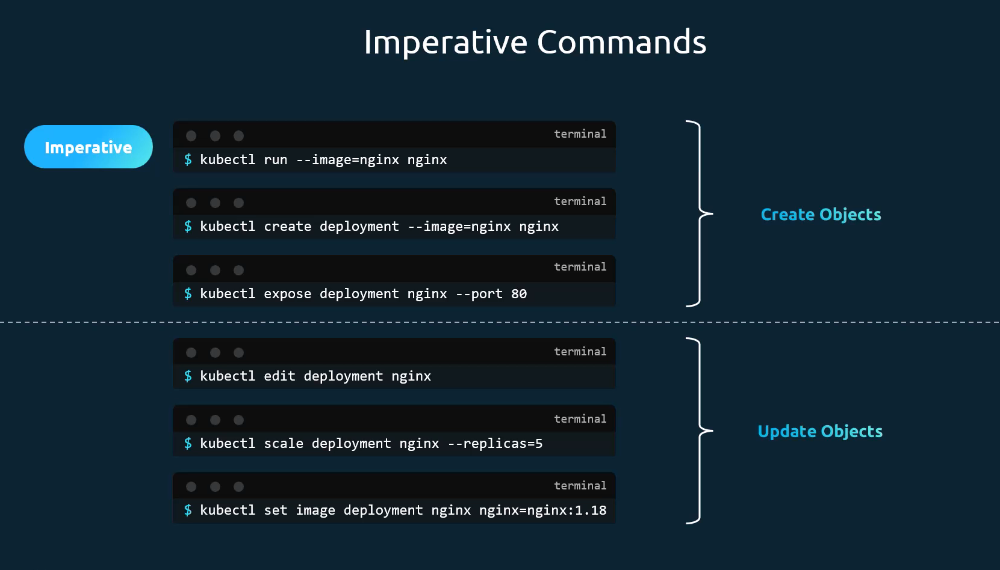

```bash
kubectl edit pod myapp-pod --> are not recorded anywhere
kubectl replace -f nginx.yaml
kubectl replace --force -f nginx.yaml

# declarative - will check automatically for conflicts and configs errors
kubectl apply -f nginx.yaml
kubectl apply -f /path/to/config-files
```

**Tips**

```bash
# Service
# Create a Service named redis-service of type ClusterIP to expose pod redis on port 6379

$ kubectl expose pod redis --port=6379 --name redis-service --dry-run=client -o yaml

# (This will automatically use the pod's labels as selectors) Or

$ kubectl create service clusterip redis --tcp=6379:6379 --dry-run=client -o yaml

# (This will not use the pods labels as selectors, instead it will assume selectors as app=redis. You cannot pass in selectors as an option. So it does not work very well if your pod has a different label set. So generate the file and modify the selectors before creating the service)

# Create a Service named nginx of type NodePort to expose pod nginx's port 80 on port 30080 on the nodes:

$ kubectl expose pod nginx --type=NodePort --port=80 --name=nginx-service --dry-run=client -o yaml

# (This will automatically use the pod's labels as selectors, but you cannot specify the node port. You have to generate a definition file and then add the node port in manually before creating the service with the pod.)

# Or

$ kubectl create service nodeport nginx --tcp=80:80 --node-port=30080 --dry-run=client -o yaml

# (This will not use the pods labels as selectors)

# Both the above commands have their own challenges. While one of it cannot accept a selector the other cannot accept a node port. I would recommend going with the kubectl expose command. If you need to specify a node port, generate a definition file using the same command and manually input the nodeport before creating the service.
```

### kubectl explain command

- api-resources
- `kubectl api-resources`
- `kubectl explain pods`
- `kubectl explain pods.spec`
- `kubectl explain pods --recursive`

### kubectl apply

- Uses Local file , last applied configuration and kubernetes (live object configuration) in considerations
- last applied configuration : stored in Live object configuration as annotations

---

## Section 3: Scheduling

### Node Name

- define nodeName: in spec: section

```bash
$ kubectl get pods -n kube-system

# replace the old pod and create with updated nginx.yaml file
$ Kubectl replace --force -f nginx.yaml

$ kubectl get pods --watch

# labels
metadata:
  name:
  labels:
    app:
    Function:

$ kubectl get pods --selector app=App1

$ kubectl get all --selector env=prod --no-headers | wc -l
```

### Taints and Tolerations

- Person-> Node
- Pods -> Bugs
- Taints are set on Nodes, Tolerations are set on Pods

```bash
# taint-effect -> what happens to PODs that do not tolerate this taint
# NoSchedule: Pods will not be scheduled on Node
# PreferNoSchedule : System will try to avoid to put in Node but not guarentee
# NoExecute: New Pods will not be schedule on Node, an existing will be evicted if
# they don't tolerate taint

$ kubectl taint nodes node-name key=value:taint-effect
$ kubectl taint nodes node1 app=myapp:NoSchedule

$ kubectl taint nodes node1 app=blue:NoSchedule
apiVersion: v1
kind: Pod
metadata:
  name: myapp-pod
  spec:
    containers:
    - name: nginx-container
      image: nginx
    tolerations:
    - key: "app"
      operator: "Equal"
      value: "blue"
      effect: "NoSchedule"
```

- Best Practice not deploy application workloads in master server
  `kubectl describe node kubemaster | grep Taint`
- To untaint the node
  `kubectl taint nodes controlplane node-role.kubernetes.io/control-plane:NoSchedule-`

### Node Selectors

- under spec section nodeSelector: --> size: Large (get the value from labels)
- Label nodes
  `kubectl label nodes <node-name> <label-key>=<label-value> `
- Limitations: varying sizes nodes like large, medium, small etc 'or' 'not' not possible

### Node Affinity

- spec --> affinity and nodeAffinity

  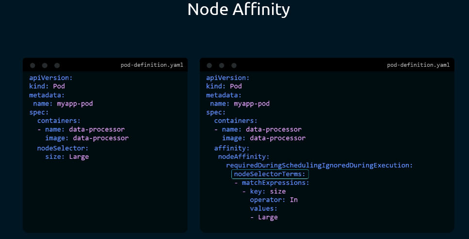

```bash
- matchExpressions:
  - key: size
    operator: NotIn
    values:
    - Small
    - Medium

 - key: size
   operator: Exists

$ kubectl edit deployment <name>
```

- lab
- The type of node affinity defines the behavior of the scheduler with respect to node affinity and the stages in the lifecycle of the pod.
- Two types of nodeAffinity available
  - requiredDuringSchedulingIgnoredDuringExecution
  - preferredDuringSchedulingIgnoredDuringExecution

  Planned:
  - requiredDuringSchedulingRequiredExecution

  DuringScheduling:
  the state where a pod doesnot exist and is created for the first time. We have no doubt that when a pod is first created, the affinity rules specified are considered to place the pods on right node.

  What if the nodes with matching labels are not available ?
  For example, we forgot to label the node as large. That is where the type of node affinity used comes into play. If we select the required type, which is the first one, the scheduler will mandate that the pod be placed on a node with the given affinity rules. If it cannot find one, the pod will not be scheduled.
  This type will be used in cases where the placement of the pod is crucial.
  If a matching node does not exist the pod will bot be scheduled.

  Let's say the pod placement is less important than running the workload itself.In that case we could set it to preferred. And in cases where a matching node is not found, the scheduler will simply ignore node affinity rules and place the pod on any available node. This is a way of telling the scheduler, hey tey your best to place the pod on matching node, but if you really cannot find one, just place it anywhere.

  The second part of the propert or the other state is during execution. During execution is the state where a pod has been running, and a change is made in the environment that affects node affinity such as change in the label of a node. For example, an administrator removed the label we set earlier called size equals large from the node
  What would happen to the pods that are running on the node ?
  The two types of node affinity available today has this value set to ignored which means pods will continue to run and any changes in node affinity will not impact them once they are scheduled.

  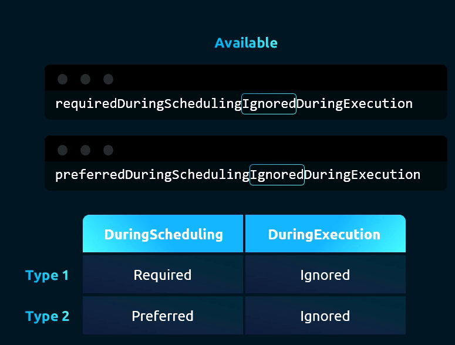

```yaml
apiVersion: apps/v1
kind: Deployment
metadata:
  name: blue
spec:
  replicas: 3
  selector:
    matchLabels:
      run: nginx
  template:
    metadata:
      labels:
        run: nginx
    spec:
      containers:
      - image: nginx
        imagePullPolicy: Always
        name: nginx
      affinity:            # affinity rules added from here
        nodeAffinity:
          requiredDuringSchedulingIgnoredDuringExecution:
            nodeSelectorTerms:
            - matchExpressions:
              - key: color
                operator: In
                values:
                - blue
```

### Node Affinity vs Taints and Tolerations

### Requirements

- Resource Request
- Resource Limit
- Default Behavior : No CPU/MEM resource limit set

```yaml
apiVersion: v1
kind: Pod
metadata:
    name: simple-webapp-color
    labels:
      name: simple-webapp-color
spec:
  containers:
  - name: simple-webapp-color
    image: simple-webapp-color
    ports:
      - containerPort: 8080
    resources:
      requests:
        memory: "4Gi"
        cpu: 2
      limits:
        memory: "2Gi"
        cpu: 2
```

- LimitRange

```yaml
apiVersion: v1
kind: LimitRange
metadata:
  name: cpu-resource-constraint or memory
spec:
  limits:
  - default:
      cpu: 500m
    defaultRequest:
      cpu: 500m
    max:
      cpu: "1"
    min:
      cpu: 100m
    type: Container
```

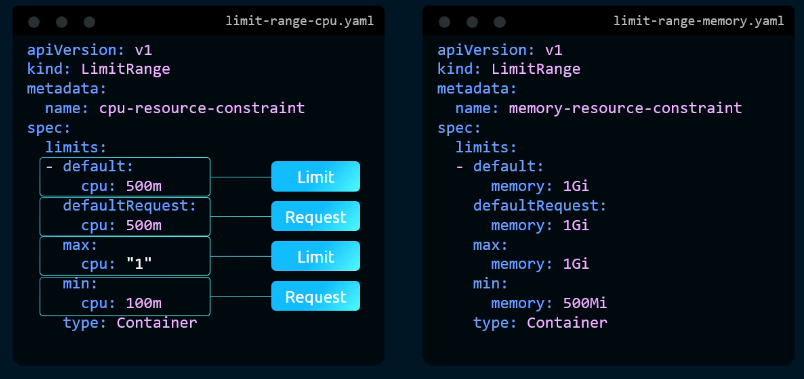

- Resource Quotas at namespace level

```yaml
apiVersion: v1
kind: ResourceQuota
metadata:
  name: my-resource-quota
spec:
  hard:
    requests.cpu: 4
    requests.memory: 4Gi
    limits.cpu: 10
    limits.memory: 10Gi
```

**Notes: Edit a POD**

Remember, you CANNOT edit specifications of an existing POD other than the below.

- spec.containers[*].image
- spec.initContainers[*].image
- spec.activeDeadlineSeconds
- spec.tolerations

For example you cannot edit the environment variables, service accounts, resource limits (all of which we will discuss later) of a running pod. But if you really want to, you have 2 options:

1. Run the `kubectl edit pod <pod name>` command.  This will open the pod specification in an editor (vi editor). Then edit the required properties. When you try to save it, you will be denied. This is because you are attempting to edit a field on the pod that is not editable.

   A copy of the file with your changes is saved in a temporary location as shown above. `/tmp/kubectl-edit-ccvrq.yaml`

   You can then delete the existing pod by running the command:

   `kubectl delete pod webapp`

   Then create a new pod with your changes using the temporary file

   `kubectl create -f /tmp/kubectl-edit-ccvrq.yaml`

2. The second option is to extract the pod definition in YAML format to a file using the command

   `kubectl get pod webapp -o yaml > my-new-pod.yaml`

   Then make the changes to the exported file using an editor (vi editor). Save the changes

   `vi my-new-pod.yaml`

   Then delete the existing pod

   `kubectl delete pod webapp`

   Then create a new pod with the edited file

   `kubectl create -f my-new-pod.yaml`

**Edit Deployments**

With Deployments you can easily edit any field/property of the POD template. Since the pod template is a child of the deployment specification,  with every change the deployment will automatically delete and create a new pod with the new changes. So if you are asked to edit a property of a POD part of a deployment you may do that simply by running the command

`kubectl edit deployment my-deployment `

`kubectl replace --force -f /tmp/file.yaml`

### DaemonSets

- uses Monitoring solution and logs viewer
- worker node component required on every node is kube-proxy , that is one good use case of DaemonSets
- Another use case is networking solution like **calico** requires an agent to be deployed on each node in cluster

```yaml
apiVersion: apps/v1
kind: DaemonSet
metadata:
  name: monitoring-daemon
spec:
  selector:
    matchLabels:
      app: monitoring-agent
  template:
    metadata:
      labels:
        app: monitoring-agent
    spec:
      containers:
      - name: monitoring-agent
        image: monitoring-agent
```

`kubectl describe daemonsets or ds <name> -n <namespace>`

`kubectl get ds -n <name>`

### Static Pods

- `/etc/kubernetes/manifests`
- A standalone worker node without interaction to the API Server can create the pods on it's own and run continers (CRE): containerd, rkt etc on it's own using the above manifest file path
- By using the flag in kubelet.service `--pod-manifest-path=/etc/kubernetes/manifests`
- or    `--config=kubeconfig.yaml` then set the statisPodPath: /etc/kubernetes/manifests in kubeconfig.yaml file

  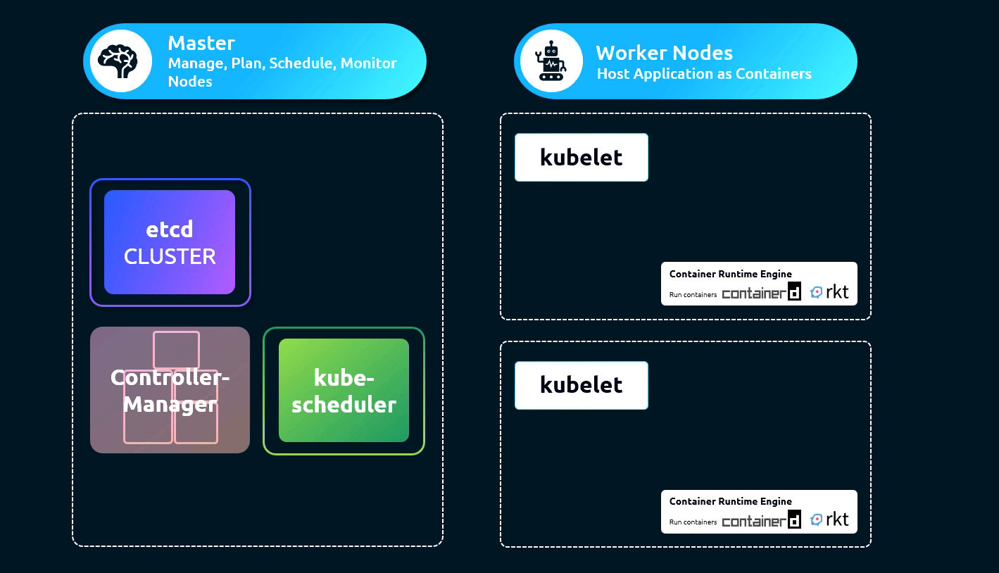

- `kubectl get pods -n kube-system`

  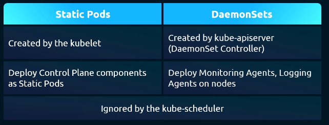

- Fiding the path of the directory currently holding the static pod definition files

  `grep -i  staticPodPath /var/lib/kubelet/config.yaml`

```bash
# first identify the kubelet config file

root@controlplane:~# ps -aux | grep /usr/bin/kubelet

root      3668  0.0  1.5 1933476 63076 ?       Ssl  Mar13  16:18 /usr/bin/kubelet --bootstrap-kubeconfig=/etc/kubernetes/bootstrap-kubelet.conf --kubeconfig=/etc/kubernetes/kubelet.conf --config=/var/lib/kubelet/config.yaml --network-plugin=cni --pod-infra-container-image=k8s.gcr.io/pause:3.2

root      4879  0.0  0.0  11468  1040 pts/0    S+   00:06   0:00 grep --color=auto /usr/bin/kubelet
root@controlplane:~#

# Next lookup the value assigned for staticPodPath
root@controlplane:~# grep -i staticPodPath /var/lib/kubelet/config.yaml
staticPodPath: /etc/kubernetes/manifests
root@controlplane:~#
```

`kubectl run --restart=Never --image=busybox static-busybox --dry-run=client -o yaml --command -- sleep 1000 > /etc/kubernetes/manifests/static-busybox.yaml`

or

`kubectl run static-busybox --image=busybox --dry-run=client -o yaml --command -- sleep 1000 > static-busybox.yaml`

- updating the image in running pod

  `kubectl set image pod/<pod-name> <container-name>=<new-image>:<tag>`

  or

  `kubectl apply -f your-pod-file.yaml`

### Priorities

- define using range of number high as 1B low as -2B (apps/workloads deployed as apps )
- For internal system critical pods (like kubernetes control node pods)
- `kubectl get priorityclass`

```yaml
apiVersion: scheduling.k8s.io/v1
kind: PriorityClass
metadata:
  name: high-priority
value: 1000000000
description: "Priority class for mission critical pods"
preemptionPolicy: PreemptLowerPriority (never- pods make other pods wait to be scheduled)

# now in pod definition
spec:
  containers:
    ..
    ....
  priorityClassName: high-priority
```

- `kubectl describe priorityclass system-node-critical`
- compare the priority classes on both pods using `kubectl get pods -o custom-columns="NAME:.metadata.name,PRIORITY:.spec.priorityClassName"`
- Extract yaml file from existing pod

```yaml
kubectl get pod critical-app -o yaml > critical-app.yaml

# critical-app.yaml
apiVersion: v1
kind: Pod
metadata:
...
name: critical-app
...
spec:
containers:
- image: nginx
    imagePullPolicy: Always
    name: critical-container
    ...
dnsPolicy: ClusterFirst
priorityClassName: high-priority   # Add the high-priority class
enableServiceLinks: true
preemptionPolicy: PreemptLowerPriority
priority: 0  # Remove this line as this is the old default priority
...
```

```bash
kubectl delete pod <pod>

kubectl apply -f sample.yaml
```

### Multiple Scheduler

- custom scheduling algorithm

```yaml
apiVersion: kubescheduler.config.k8s.io/v1
kind: KubeSchedulerConfiguration
profiles:
- schedulerName: default or <any-custom-name>
```

```bash
# deploying an Additional Scheduler
$ wget https://storage.googleapis.com/kubernetes-release/release/v1.XX.0/bin/linux/amd64/kube-scheduler

#kube-scheduler.service , can use same scheduler binaries or use one that we might have built ourself
ExecStart=/usr/local/bin/kube-scheduler \
  --config=/etc/kubernetes/config/kube-scheduler.yaml

# point to separate file
ExecStart=/usr/local/bin/kube-scheduler \
  --config=/etc/kubernetes/config/my-kube-scheduler-2-config.yaml
```

- This is not how we would deploy a custom scheduler 99% of the time today, because with kube ADM deployment all the control plane components run as a pod or a deployment within the kubernetes cluster.
- Deploying as a pod

  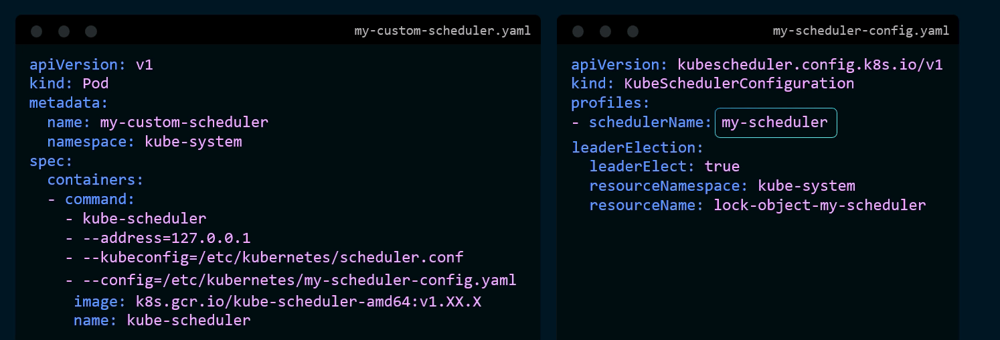

  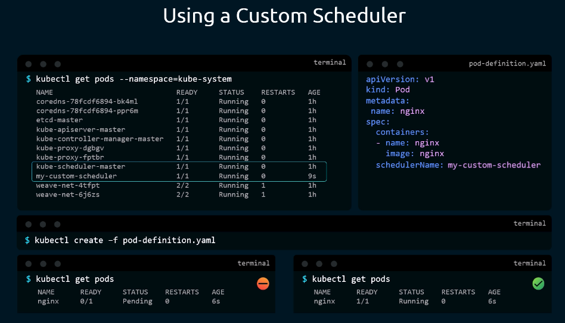

```bash
kubectl get events -o wide

kubectl logs my-custom-scheduler --namespace=kube-system

kubectl get serviceaccount -n <namespace>

kubectl get clusterrolebinding
```

### Admission Controllers

```bash
kube-apiserver -h | grep enable-admission-plugins

# on kube-adm based setup
kubectl exec kube-apiserver-controlplane -n kube-system -- kube-apiserver -h | grep enable-admission-plugins

kubectl run
```

- To add admission controller update the kube-apiserver.service

  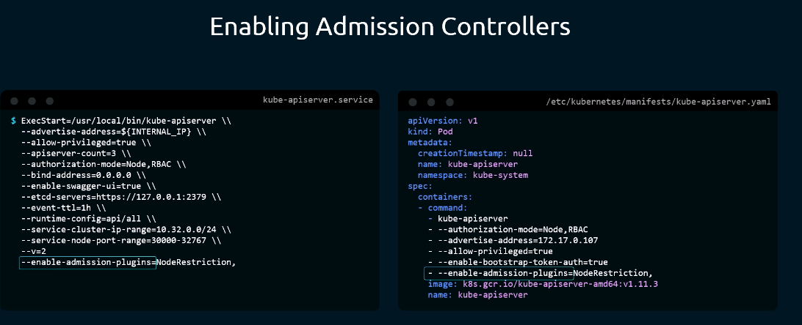

- reconfiguring the API server to enable the ImagePolicyWebhook admission plugin and ensuring that i can access the configuration files

```bash
Edit /etc/kubernetes/manifests/kube-apiserver.yaml:

cp /etc/kubernetes/manifests/kube-apiserver.yaml /opt/kube-apiserver.yaml.bak
vi /etc/kubernetes/manifests/kube-apiserver.yaml

1. Enable the admission plugin:

    - --enable-admission-plugins=NodeRestriction,ImagePolicyWebhook

2. Add the admission control config file:

    - --admission-control-config-file=/etc/kubernetes/imgvalidation/admission-configuration.yaml

3. Mount the imgvalidation directory:

Add to volumes:

    - name: imgvalidation
      hostPath:
        path: /etc/kubernetes/imgvalidation
        type: Directory

Add to volumeMounts:

    - name: imgvalidation
      mountPath: /etc/kubernetes/imgvalidation
      readOnly: true

4. Verify the API server is running:

kubectl get pods -n kube-system
```

### Validating and Mutating Admission Controllers

- `kubectl describe pvc myclaim`
- PersistentVolumeClaim
- Mutating Admission Controllers: Those that can change or mutate the object itself before it is created
- Validating Admission Controllers: Those that can validate the request and allow or deny

```bash
kubectl -n webhook-demo create secret tls webhook-server-tls \
--cert "/root/keys/webhook-server-tls.crt" \
--key "/root/keys/webhook-server-tls.key"
```

```yaml
# A pod with a securityContext explicitly allowing it to run as root.
# The effect of deploying this with and without the webhook is the same. The
# explicit setting however prevents the webhook from applying more secure
# defaults.
apiVersion: v1
kind: Pod
metadata:
  name: pod-with-override
  labels:
    app: pod-with-override
spec:
  restartPolicy: OnFailure
  securityContext:
    runAsNonRoot: false
  containers:
    - name: busybox
      image: busybox
      command: ["sh", "-c", "echo I am running as user $(id -u)"]
```

### Logging and Monitoring

```bash
kubectl top node
kubectl top pod
```

### Managing Application Log

```yaml
apiVersion: v1
kind: Pod
metadata:
  name: event-simulator-pod
spec:
  containers:
  - name: event-simulator
    image: kodekloud/event-simulator
  - name: image-processor
    image: some-image-processor
```

```bash
$ kubectl logs -f event-simulator-pod event-simulator
```

### Application Lifecycle Management

```bash
# view changes made to out deployment
kubectl rollout status deployment/myapp-deployment

# revision and history
kubectl rollout history deployment/myapp-deployment

# edit the definition file or use following command
kubectl edit deployment <name>
kubectl set image deployment <deployment-name> container-name=Image:version

# rollout to previous version
kubectl rollout undo deployment <deployment-name>

# Commands and Arguments
command: [ "sleep",  "5000"] or
command:
- "sleep"
- "5000"

# if we need to force edit
kubectl edit pod <pod-name>
kubectl replace --force -f <temp-file-name-automatically-created>

# command overrides entrypoint, args override CMD in dockerfile

kubectl run webapp-green --image=kodekloud/webapp-color --dry-run=client -o yaml

kubectl run nginx --image=nginx -- <arg1> <argN>

kubectl run webapp-green --image=kodekloud/webapp-color --  --color green

# configMaps
kubectl get configmaps or cm for short

# get output in yaml
kubectl get pod <pod-name> -o yaml
kubectl create configmap webapp-config-map --from-literal APP_COLOR=darkblue --from-literal APP_OTHER=disregard
```

**ConfigMap**

```yaml
---
apiVersion: v1
kind: Pod
metadata:
  labels:
    name: webapp-color
  name: webapp-color
  namespace: default
spec:
  containers:
  - env:
    - name: APP_COLOR
      valueFrom:
        configMapKeyRef:
          name: webapp-config-map
          key: APP_COLOR
    image: kodekloud/webapp-color
    name: webapp-color
```

**Secrets**

```bash
kubectl get secrets

# Run the command: kubectl describe secrets dashboard-token and look at the data field.
# There are three secrets - ca.crt, namespace and token.

sed -i 's/^DB_Host:.* /DB_Host: c3FsMDE=/' db-secret.yaml

sed -i 's/DB_Host: cdher/DB_Host: cenew/' file.txt

kubectl create secret generic db-secret \
--from-literal=DB_Host=sql01 \
--from-literal=DB_User=root \
--from-literal=DB_Password=password123

kubectl get pod webapp-pod -o yaml > webapp-pod.yaml
kubectl delete pod webapp-pod
```

```yaml
apiVersion: v1
kind: Pod
metadata:
  name: webapp-pod
  labels:
    name: webapp-pod
  namespace: default
spec:
  containers:
  - name: webapp
    image: kodekloud/simple-webapp-mysql
    imagePullPolicy: Always
    envFrom:
    - secretRef:
        name: db-secret
```

```bash
kubectl apply -f webapp-pod.yaml
```

**Multi Container Pods**

```yaml
apiVersion: v1
kind: Pod
metadata:
  name: yellow
spec:
  containers:
  - name: lemon
    image: busybox
    command: [ "sleep", "1000" ]
  - name: gold
    image: redis
```

```bash
kubectl -n elastic-stack logs kibana

# if single container
kubectl exec app -- less /log/app.log

# multiple container
kubectl exec <pod-name> -c <container-name> -- cat /path/to/logfile.log
```

```yaml
...
initContainers:
- name: sidecar
  image: kodekloud/filebeat-configured
  restartPolicy: Always
  volumeMounts:
    - name: log-volume
      mountPath: /var/log/event-simulator/
```

```bash
k get pods -n elastic-stack

k logs app -n elastic-stack -c sidecar

kubectl get pod app -n elastic-stack -w
```

---

## InitContainers

Understanding Init and Sidecar Containers in Kubernetes

In a multi-container Pod, each container is expected to run a process that stays alive for the entire lifecycle of the Pod.

For example, in a Pod with a web application and a logging agent, both containers are expected to remain active throughout the Pod's lifecycle. The process in the logging agent container must stay alive as long as the web application is running. If any main container fails and the Pod's restartPolicy is Always or OnFailure, the entire Pod is restarted.

### Pod Restart Behavior in Multi-Container Pods

In a multi-container Pod, the restartPolicy applies at the container level, not the Pod level. If a container exits, the kubelet restarts that individual container in place according to the policy—other containers in the Pod are unaffected and keep running.

- Always (default): restarts the container after any exit, regardless of exit code.
- OnFailure: restarts only on a non-zero exit code.
- Never: never restarts.

The policy applies to app containers and regular init containers. Sidecar containers (init containers with their own container-level restartPolicy: Always) always restart regardless of the Pod's restartPolicy.

Kubernetes does not restart the entire Pod when one container fails. The Pod is recreated only by its controller when the node dies or the Pod is removed.

### What is an Init Container?

An init container is a special container that runs before the main containers in a Pod. Each init container must succeed (exit 0) before the next one is started. Once all init containers complete, the regular containers start simultaneously.

They are configured similarly to other containers but are placed in the initContainers section of the Pod spec.

- If any init container fails, the entire Pod is restarted and all init containers are rerun from the beginning.

### Using Init Containers

```yaml
apiVersion: v1
kind: Pod
metadata:
  name: myapp-pod
  labels:
    app: myapp
spec:
  initContainers:
    - name: init-myservice
      image: busybox:1.31
      command: ["sh", "-c", "until nslookup myservice; do echo waiting for myservice; sleep 2; done;"]
    - name: init-mydb
      image: busybox:1.31
      command: ["sh", "-c", "until nslookup mydb; do echo waiting for mydb; sleep 2; done;"]
  containers:
    - name: myapp-container
      image: busybox:1.28
      command: ["sh", "-c", "echo The app is running! && sleep 3600"]
```

### Native Sidecar Containers (Kubernetes 1.33+)

Starting with Kubernetes v1.33, sidecar containers are natively supported. This allows sidecar containers to follow a defined lifecycle relative to the main containers in the Pod — without requiring entrypoint hacks.

### How Native Sidecars Work

- Declared using the restartPolicy: Always field inside the initContainers block.
- Kubernetes treats such containers as sidecars, ensuring they:
  - Start before main containers.
  - Run alongside them.
  - Shut down after the main containers complete.

### Native Sidecar Configuration

```yaml
apiVersion: v1
kind: Pod
metadata:
  name: sidecar-example
spec:
  initContainers:
    - name: sidecar-logger
      image: busybox:1.31
      restartPolicy: Always
      command: ["sh", "-c", "while true; do echo Sidecar running; sleep 10; done"]
  containers:
    - name: main-app
      image: busybox:1.31
      command: ["sh", "-c", "echo Main app starting; sleep 60"]
```

In this setup:

- The sidecar-logger container behaves like a sidecar, though declared in initContainers.
- It uses restartPolicy: Always to stay alive throughout the Pod lifecycle.
- Kubernetes starts the sidecar first, waits for readiness, then starts the main app.

```bash
kubectl get pods -o custom-columns="POD:.metadata.name,INIT_CONTAINERS:.spec.initContainers[*].name"

for pod in red green blue; do echo "Pod: $pod" && kubectl get pod $pod -o yaml | grep -i initContainers; done

kubectl get pod blue -o custom-columns="INIT_IMAGE:.spec.initContainers[*].image"

k logs <container>

k logs orange -c init-myservice
```

## Autoscaling

```bash
kubectl scale deployment flask-web-app --replicas=3
```

```yaml
apiVersion: autoscaling/v2
kind: HorizontalPodAutoscaler
metadata:
  creationTimestamp: null
  name: nginx-deployment
spec:
  maxReplicas: 3
  metrics:
  - resource:
      name: cpu
      target:
        averageUtilization: 80
        type: Utilization
    type: Resource
  scaleTargetRef:
    apiVersion: apps/v1
    kind: Deployment
    name: nginx-deployment
status:
  currentMetrics: null
  desiredReplicas: 0
  currentReplicas: 0
```

```bash
kubectl get hpa
```

```yaml
apiVersion: apps/v1
kind: Deployment
metadata:
  name: nginx-deployment
  labels:
    app: nginx
spec:
  replicas: 7
  selector:
    matchLabels:
      app: nginx
  template:
    metadata:
      labels:
        app: nginx
    spec:
      containers:
      - name: nginx
        image: nginx:1.14.2
        ports:
        - containerPort: 80
        resources:
          requests:
            cpu: 100m
          limits:
            cpu: 200m
```

```bash
kubectl replace --force -f deployment.yml

kubectl get hpa --watch
```

## In-Place Pod Resizing

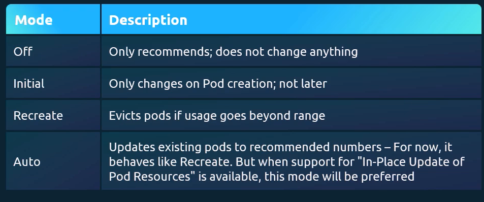

```bash
# command that picks the name of the vpa-updater and print its logs
kubectl logs $(kubectl get pods -n kube-system --no-headers -o custom-columns=":metadata.name" | grep vpa-updater) -n kube-system

# increase replica count
kubectl scale deployment flask-app --replicas=2

# verify deployments
kubectl get deployment flask-app -o wide

# check the pod status
kubectl get pods -l app=flask-app

# verify VPA operation
kubectl describe vpa flask-app

# view the resource consumption of the pods
kubectl top pod
```

---

## Cluster Maintenance

```bash
# drain node of all the workloads and mark if unschedulable
kubectl drain <node> --ignore-daemonsets

# only mark node unschedulable, do not terminate or move the existing pods
kubectl cordon <node>

# uncordon
kubectl uncordon <node>

# check for the version
kubectk version
kubectl get nodes

kubectl get nodes -o custom-columns="NODE:.metadata.name,TAINTS:.spec.taints[*].effect"

kubectl describe node <node> | grep -i taints

# check the latest version available for an upgrade with the current version
kubeadm upgrade plan

kubectl drain controlplane --ignore-daemonsets

# on control plane node (upgrading master)
vim /etc/apt/sources.list.d/kubernetes.list

# update the version in the URL to next available minor releases i.e v1.35
deb [signed-by=/etc/apt/keyrings/kubernetes-apt-keyring.gpg] https://pkgs.k8s.io/core:/stable:/v1.35/deb/ /

apt update

apt-cache madison kubeadm

# one of the version from above command is 1.35.0-1.1
apt-get install kubeadm=1.35.0-1.1 or alternatively 1.35.0-*

# commands to upgrade kubernetes cluster
kubeadm upgrade plan v1.35.0
kubeadm upgrade apply v1.35.0

# upgrade the kubelet version, also mark the node as schedulable if not schedulable
apt-get install kubelet=1.35.0-1.1

# refresh systemd configuration and apply changes to the kubelet service
systemctl daemon-reload

systemtctl restart kubelet

kubectl uncordon controlplane


#---- upgrading worker node ---
kubectl drain node01 --ignore-daemonsets

# rest same as control plane t
```

## Backup & Restore

- etcd is deployed as a static pod on the master, version is v3

```bash
# verify version
etcdctl version

# Backing up ETCD, taking a snapshot from running etcd server
ETCDCTL_API=3 etcdctl \
--endpoints=https://127.0.0.1:2379 \
--cacert=/etc/kubernetes/pki/etcd/ca.crt \
--cert=/etc/kubernetes/pki/etcd/server.crt \
--key=/etc/kubernetes/pki/etcd/server.key \
snapshot save /backup/etcd-snapshot.db

--cert = path to the client cert
--key = path to the client key

# etcdutl (file-based backup)
# offline file-level backup of the data directory
etcdutl backup \
--data-dir /var/lib/etcd \
--backup-dir /backup/etcd-backup

-> This copies the etcd backend database and WAL files to the target location.

# checking snapshot status
etcdctl snapshot status /backup/etcd-snapshot.db \
--write-out=table

# Restore etcdutl
etcdutl snapshot restore /backup/etcd-snapshot.db \
--data-dir /var/lib/etcd-restored

# To use a backup made with etcdutl backup, simply copy the backup contents back into /var/lib/etcd and restart etcd.
etcdctl snapshot save --> is used for creating .db snapshots from live etcd clusters.

etcdctl snapshot status --> provides metadata information about the snapshot file.

etcdutl snapshot restore --> is used to restore a .db snapshot file.

etcdutl backup --> performs a raw file-level copy of etcd's data and WAL files without needing etcd to be running.
```

### Lab

```bash
etcd version
kubectl -n kube-system describe pod etcd-controlplane | grep -i image

root@controlplane:~# kubectl -n kube-system describe pod etcd-controlplane | grep '\--listen-client-urls'
  --listen-client-urls=https://127.0.0.1:2379,https://10.2.43.11:2379

# backup before maintenance window
etcdctl --endpoints=https://127.0.0.1:2379 \
--cacert=/etc/kubernetes/pki/etcd/ca.crt \
--cert=/etc/kubernetes/pki/etcd/server.crt \
--key=/etc/kubernetes/pki/etcd/server.key \
--key=/etc/kubernetes/pki/etcd/server.key \
snapshot save /opt/snapshot-pre-boot.db
```

**Restore**

```bash
Step 1: Stop the kube-apiserver
mv /etc/kubernetes/manifests/kube-apiserver.yaml /tmp/
sleep 30

Step 2: Restore the etcd snapshot
etcdutl snapshot restore /opt/snapshot-pre-boot.db --data-dir /var/lib/etcd-from-backup

Step 3: Update the etcd configuration
vi /etc/kubernetes/manifests/etcd.yaml

#modify the volumes section
From:
volumes:
- hostPath:
    path: /etc/kubernetes/pki/etcd
    type: DirectoryOrCreate
    name: etcd-certs
- hostPath:
    path: /var/lib/etcd                    # OLD directory
    type: DirectoryOrCreate
    name: etcd-data

To:
volumes:
- hostPath:
    path: /etc/kubernetes/pki/etcd
    type: DirectoryOrCreate
    name: etcd-certs
- hostPath:
    path: /var/lib/etcd-from-backup        # NEW restored directory
    type: DirectoryOrCreate
    name: etcd-data

# upon saving etcd pod will automatically restart due to static pod behavior

Step 4: Restart kube api-server
# move manifest file back to original location
mv /tmp/kube-apiserver.yaml /etc/kubernetes/manifests/

# wait for 60 seconds to allow the kube-apiserver to start

Step 5: Restart other control plane components
# restart kube-controller-manager
mv /etc/kubernetes/manifests/kube-controller-manager.yml /tmp/
sleep 20

# restart kube-scheduler
mv /etc/kubernetes/manifests/kube-scheduler.yml /tmp/
sleep 20
mv /tmp/kube-scheduler.yml /etc/kubernetes/manifests/

# restart kubelet
systemctl restart kubelet

Step 6: Monitor the restart process
watch crictl ps
-> all components showuld show STATUS = Running

Step 7: Verify the restore
# check all resources accross all namespaces
kubectl get deployments,services --all-namespaces

# verify specific resources if needed
kubectl get pods -all-namespaces
kubectl get nodes
```

## Security

### Certificate Inspection

```bash
# view kube-apiserver manifests file and then look for value of flags for certs
cat /etc/kuberenetes/manifests/kube-apiserver.yaml

# find the common name (CN) configured on the Kube API server certficiate
openssl x509 -in /etc/kubernetes/pki/apiserver.crt -text
```

### Troubleshooting Control Plane Components

```bash
# when main componenets of kubernetes like kube-apiserver or etcd foes down need to one
# step down to docker, list all containers
crictl ps -a

# check log
crictl logs <container>
```

### Certificates API

```bash
# generate key
openssl genrsa -out jane.key 2048

openssl req -new -key jane.key -subj "/CN=jane" -out jane.csr
```

- Sent to admin, now admin creates CSR object

```yaml
apiVersion: certificates.k8s.io/v1
kind: CertificateSigningRequest
metadata:
  name: jane-csr
spec:
  signerName: Kubernetes.io/kube-apiserver-client
  expirationSeconds: 600
  usages:
  - client auth
  request: <BASE64_ENCODED_CSR>
  conditions:
  - type: Approved
    status: "True"
    reason: KubectlApprove
    message: "This CSR was approved by kubectl certificate approve."
    lastUpdateTime: "2026-02-03T11:46:10Z"
```

```bash
# for BASE64_ENCODED_CSR, disable wrapping with (-w 0)
cat akshay.csr | base64 -w 0   # ---> move the output below request field

# see the requests
kubectl get or delete csr

# approve the new request
kubectl certificate approve or dney <csr, eg: jane>

# view the certificate by viewing yaml format
kubectl get csr jane -o yaml

# decode
echo "Ls0....=" | base64 --decode   # ---> then can be shared with end users
```

- Controller manager is responsible for all the certificate related tasks

**Lab**

```yaml
apiVersion: certificates.k8s.io/v1
kind: CertificateSigningRequest
metadata:
  name: akshay
spec:
  groups:
  - system:authenticated
  request: <Paste the base64 encoded value of the CSR file>
  signerName: kubernetes.io/kube-apiserver-client
  usages:
  - client auth
```

---

## Security KubeConfig

```bash
kubectl get pods \
--server my-kube-playground:6443 \
--client-key admin.key \
--client-certificate admin.crt \
--certificate-authority ca.crt

# typing the above flag every time is tedious so instead can move it to $HOME/.kube/config
--server my-kube-playground:6443
--client-key admin.key
--client-certificate admin.crt
--certificate-authority ca.crt

kubectl get pods \
--kubeconfig config
```

- KubeConfig file has three sections:
  - Cluster: Development environments for: Production, Google.
  - Contexts: define which user account will be used to access which cluster. Eg. Admin@Production -> use admin account to access a production cluster
  - Users: accounts with which we have access to these cluster, may have different privileges.

```yaml
apiVersion: v1
kind: Config
current-context: dev-user@google
clusters:
- name: my-kube-playground
  cluster:
    certificate-authority:
    # instead of certificate authority we can provide
    certificate-authority-data: <base64-encoded-data>
    server: https://my-kube-playground:6443

contexts:
- name: my-kube-admin@my-kube-playground
  context:
    cluster: my-kube-playground
    user: my-kube-admin
    namespace: finance

users:
- name: my-kube-admin
  user:
    client-certificate: admin.crt   # better to use full path like /etc/kubernetes/pki/users/admin.crt
    client-key: admin.key
```

```bash
kubectl config view

kubectl config view --kubeconfig=my-custom-config

# change context
kubectl config use-context prod-user@production
```

**Lab**

```bash
kubectl config --kubeconfig=/root/my-kube-config use-context research
Switched to context "research".

kubectl config --kubeconfig=/root/my-kube-config current-context

# when we don't want to specify the kubeconfig file option on each kubectl command
vi ~/.bashrc

# add
export KUBECONFIG=/root/my-kube-config
# OR
export KUBECONFIG=~/my-kube-config
# OR
export KUBECONFIG=$HOME/my-kube-config

# apply changes and reload the current shell sessions
source ~/.bashrc
```

### API Groups

```bash
# to check version
curl https://kube-master:6443/version

curl https://kube-master:6443/api/v1/pods
```

- Different api's : /metrics, /healthz, /version, /api, /apis and /logs
- APIs responsible for the cluster functionalities (/api, /apis)
- core group (/api) : core functionality exists like namespaces, pods, replication, controllers etc

```bash
curl https://localhost:6443 -k

curl https://localhost:6443 -k \
--key admin.key \
--cert admin.crt \
--cacert ca.crt

# Alternative to above
kubectl proxy
# launches proxy server on local host then we don't have to
curl http://localhost:8001 -k

curl https://localhost:6443/apis -k | grep "name"
```

- kube-proxy vs kubectl proxy: kube-proxy is used to enable connectivity between pods and services across different nodes in the cluster. **kubectl proxy** is an HTTP proxy service created by kube control utility to access the kube-apiserver.

- Key takeaways: All resources in kubernetes are grouped into different API groups. At the top level we have core API group and named API group, under named we have one for each section. Under the API groups we have different resources and each resource has a set of associated actions known as verbs. We can use these to allow or deny access to users

  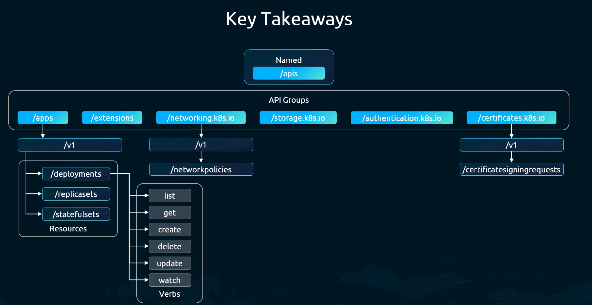


### Authorization

- Once Authenticated what can a user do? that's what authorization defines
- Why Authorization ?
  As admin can view get pods, create delete pods, i.e any operations
  we don't have other users which we will approve like developers, bots etc to have same level of access as us, we need to give minimum level of access required to the job.

- Authorization Mechanisms
  - Node: Node authorizer * Read: services, endpoints, nodes, pods
  - ABAC: we associate a user or group of users with a set of permissions. For example, we say a dev-user can view/create/delete PODs. We do this by creating policy file with a set of policies defined in a JSON format. Pass this file in to API server. Difficult to manage as for each user need to edit the configuration file and restart the kube apiserver.
  - RBAC: Much easier — instead of directly associating a user or a group with a set of permissions, we define a role. Create a role with the set of permissions required for developers. Then we associate all developers with that role. Provides more standard approach to managing access within the Kubernetes.
  - Webhook: What if we want to outsource all the authorization mechanisms, say we want to manage a authorization externally and not through the built in mechanisms that we looked above. For example, Open Policy Agent is a third party tool that helps with admission control and authorization. We can have kubernetes make an API call to the open policy agent with the information about the user and his access requirements and have the open policy agent decide if the user should be permitted or not. Based on that response, the user is granted access.

```json
{"kind": "Policy", "spec": {"user": "dev-user", "namespace": "*", "resource": "pods", "apiGroup": "*"}}
{"kind": "Policy", "spec": {"user": "dev-user-2", "namespace": "*", "resource": "pods", "apiGroup": "*"}}
{"kind": "Policy", "spec": {"user": "dev-users", "namespace": "*", "resource": "pods", "apiGroup": "*"}}
```

- Two additional modes than above:
  - AlwaysAllow: allows all request without performing the authorization checks
  - AlwaysDeny:

```bash
# the modes are defined
ExecStart=/usr/local/bin/kube-apiserver \
--authorization-mode=Node,RBAC,Webhook \
...
```

- When we have multiple modes configured our request is authorized using each one in the order it is specified.

### Role-Based Access Control (RBAC)

1. Create a role definition file

```yaml
apiVersion: rbac.authorization.k8s.io/v1
kind: Role
metadata:
  name: developer
rules:
- apiGroups: [""]
  resources: ["pods"]
  verbs: ["list", "get", "create", "update", "delete"]
- apiGroups: [""]
  resources: ["ConfigMap"]
  verbs: ["create"]
```

2. Create using role definition file

`kubectl create -f role-definition.yaml`

3. Link the user to that role, create another object called role binding

```yaml
apiVersion: rbac.authorization.k8s.io/v1
kind: RoleBinding
metadata:
  name: devuser-developer-binding
subjects:
- kind: user
  name: dev-user
  apiGroup: rbac.authorization.k8s.io
roleRef:
  kind: Role
  name: developer
  apiGroup: rbac.authorization.k8s.io
```

4. View created roles

```bash
# view
kubectl get roles

kubectl get rolebindings

kubectl describe role <role>

kubectl describe rolebindings <role-bindings>

# being user how to check the access to particular cluster
kubectl auth can-i create deployments

kubectl auth can-i delete nodes

# admin can check set of permission of other users
kubectl auth can-i create deployments --as dev-user

kubectl auth can-i create pods --as dev-user

# can also specify namespace in the command
kubectl auth can-i create pods --as dev-user --namespace test
```

- Say we have five pods in namespace, blue, green, orange, purple, and pink. We want to give access to a user to pods, but not all pods, we can restrict access to the blue and orange pod alone by adding a resource names field to the rule

```yaml
apiVersion: rbac.authorization.k8s.io/v1
kind: Role
metadata:
  name: developer
rules:
- apiGroups: [""]
  resources: ["pods"]
  verbs: ["get", "create", "delete"]
  resourceNames: ["blue", "orange"]
```

**Lab**

```bash
kubectl describe pod kube-apiserver-controlplane -n kube-system

pss -aux | grep authorization

kubectl auth can-i list pods -n default --as dev-user

kubectl get pods --as dev-user

# To create a Role:
kubectl create role developer --namespace=default --verb=list,create,delete --resource=pods

# To create a RoleBinding:
kubectl create rolebinding dev-user-binding --namespace=default --role=developer --user=dev-user

# to fix the resourceNames
kubectl edit role developer -n blue
```

OR

```yaml
kind: Role
apiVersion: rbac.authorization.k8s.io/v1
metadata:
  namespace: default
  name: developer
rules:
- apiGroups: [""]
  resources: ["pods"]
  verbs: ["list", "create", "delete"]

---
kind: RoleBinding
apiVersion: rbac.authorization.k8s.io/v1
metadata:
  name: dev-user-binding
subjects:
- kind: User
  name: dev-user
  apiGroup: rbac.authorization.k8s.io
roleRef:
  kind: Role
  name: developer
  apiGroup: rbac.authorization.k8s.io
```

- Adding additional rule to existing user

  `kubectl edit role developer -n blue`

```yaml
apiVersion: rbac.authorization.k8s.io/v1
kind: Role
metadata:
  name: developer
  namespace: blue
rules:
- apiGroups:
  - apps
  resourceNames:
  - dark-blue-app
  resources:
  - pods
  verbs:
  - get
  - watch
  - create
  - delete
- apiGroups:
  - apps
  resources:
  - deployments
  verbs:
  - create
```


### Cluster Roles

- Similar to how we grouped pods, deployments and services to namespaces, can we group Node, for example can we say Node-1 is in namespace dev and Node-02 is in namespace default?
  - No we cannot do that, those are cluster wide or cluster scoped resources, cannot be associated to particular namespaces

| Namespaced | Cluster Scoped |
|----|-----|
| pods, jobs, services, roles, rolebindings, configmaps, replicasets, deployments, secrets, PVC | nodes, PV, clusterroles, clusterbindings, certificatesigningrequests, namespaces |
| `kubectl api-resources --namespaced=true` | `kubectl api-resources --namespaced=false` |

- How do we authorize users to cluster wide resources like nodes or persistent volumes?
  - That is where Cluster role and clusterbindings comes in play. Cluster roles are just like roles, except they are for cluster scoped resources
  - Cluster Admin role can be created to create, view and delete nodes in a cluster

```yaml
apiVersion: rbac.authorization.k8s.io/v1
kind: ClusterRole
metadata:
  name: cluster-administrator
rules:
- apiGroups: [""]
  resources: ["nodes"]
  verbs: ["list", "get", "create", "delete"]
```

- Create using `kubectl create -f def-file.yaml`

- Link the user to that cluster role

```yaml
apiVersion: rbac.authorization.k8s.io/v1
kind: ClusterRoleBinding
metadata:
  name: cluster-admin-role-binding
subjects:
- kind: User
  name: cluster-admin
  apiGroup: rbac.authorization.k8s.io
roleRef:
  kind: ClusterRole
  name: cluster-administrator
  apiGroup: rbac.authorization.k8s.io
```

- Create rolebinding using `kubectl create -f role-binding.yaml`

- **We can create a cluster role for namespaced resources as well, when we do that user will have access to these resources across all namespaces.**

**Lab**

```bash
# ClusterRole is a non-namespaced resource. You can check via the
kubectl api-resources --namespaced=false

# imperative way
kubectl create clusterrole node-viewer --verb=get,list,watch --resource=nodes

kubectl create clusterrolebinding michelle-node-binding --clusterrole=node-viewer --user=michelle
```

```yaml
kind: ClusterRole
apiVersion: rbac.authorization.k8s.io/v1
metadata:
  name: node-admin
rules:
- apiGroups: [""]
  resources: ["nodes"]
  verbs: ["get", "watch", "list", "create", "delete"]

---
kind: ClusterRoleBinding
apiVersion: rbac.authorization.k8s.io/v1
metadata:
  name: michelle-binding
subjects:
- kind: User
  name: michelle
  apiGroup: rbac.authorization.k8s.io
roleRef:
  kind: ClusterRole
  name: node-admin
  apiGroup: rbac.authorization.k8s.io

# kubectl create -f <file-name>.yaml
```

- Adding storage access

```yaml
kind: ClusterRole
apiVersion: rbac.authorization.k8s.io/v1
metadata:
  name: storage-admin
rules:
- apiGroups: [""]
  resources: ["persistentvolumes"]
  verbs: ["get", "watch", "list", "create", "delete"]
- apiGroups: ["storage.k8s.io"]
  resources: ["storageclasses"]
  verbs: ["get", "watch", "list", "create", "delete"]

---
kind: ClusterRoleBinding
apiVersion: rbac.authorization.k8s.io/v1
metadata:
  name: michelle-storage-admin
subjects:
- kind: User
  name: michelle
  apiGroup: rbac.authorization.k8s.io
roleRef:
  kind: ClusterRole
  name: storage-admin
  apiGroup: rbac.authorization.k8s.io
```

### Service Accounts

- Used by machines or bots
- For example, Prometheus, Jenkins.
- How service accounts and token work in Kubernetes?
  - By default when a kubernetes cluster is setup it creates a service account by the name default in all namespaces.

- Service account gets mounted as projected volume within the pod, projected volume can be thought of as a dynamic directory created inside the pod by kubernetes automatically. Mounted inside the location `/var/run/secrets/kubernetes.io/serviceaccount`

```bash
kubectl get serviceaccount

# listing the content of directory to see the token available as a file
kubectl exec -it my-kubernetes-dashboard ls /var/run/secrets/kubernetes.io/serviceaccount

# create token, outside cluster, default valid for one hour
kubectl create token dashboard-sa

# extend the validity
kubectl create token dashboard-sa --duration 2h

# decode the token using jq and base64 utility, we can see exp defined
jq -R 'split(".") | select(length > 0) | .[0],.[1] | @base64d | fromjson' <<< eyJhfn...

# can be used to call kubernetes REST API using bearer token as authentication
curl https://192.168.56.70:6443/api --insecure \
--header "Authorization: Bearer ckadfh..."
```

- Default service account comes with lots of limitation but we can create our own.

  `kubectl create serviceaccount dashboard-sa`

- Declarative approach

```yaml
apiVersion: v1
kind: ServiceAccount
metadata:
  name: dashboard-sa
  namespace: default
# if we don't want a token to be automatically created and mounted inside the pod for the service
automountServiceAccountToken: false
```

**Lab**

```bash
kubectl set serviceaccount deploy/web-dashboard dashboard-sa

kubectl edit sa <name>

kubectl patch sa dashboard-sa -p '{"automountServiceAccountToken": false}'
```

```yaml
apiVersion: apps/v1
kind: Deployment
metadata:
  name: web-dashboard
  namespace: default
  labels:
    name: web-dashboard
spec:
  replicas: 1
  selector:
    matchLabels:
      name: web-dashboard
  template:
    metadata:
      labels:
        name: web-dashboard
    spec:
      containers:
      - name: web-dashboard
        image: gcr.io/kodekloud/customimage/my-kubernetes-dashboard
        ports:
        - containerPort: 8080
        env:
        - name: PYTHONUNBUFFERED
          value: "1"
        volumeMounts:
        - mountPath: /var/run/secrets/kubernetes.io/serviceaccount/
          name: token
          readOnly: true
      serviceAccountName: dashboard-sa
      automountServiceAccountToken: false
      volumes:
      - name: token
        projected:
          sources:
          - serviceAccountToken:
              path: token
```

```bash
kubectl apply -f web-dashboard/deployment.yaml

kubectl get pods

kubectl exec $(kubectl get pod -l name=web-dashboard -o jsonpath='{.items[0].metadata.name}') -- ls /var/run/secrets/kubernetes.io/serviceaccount/
```

